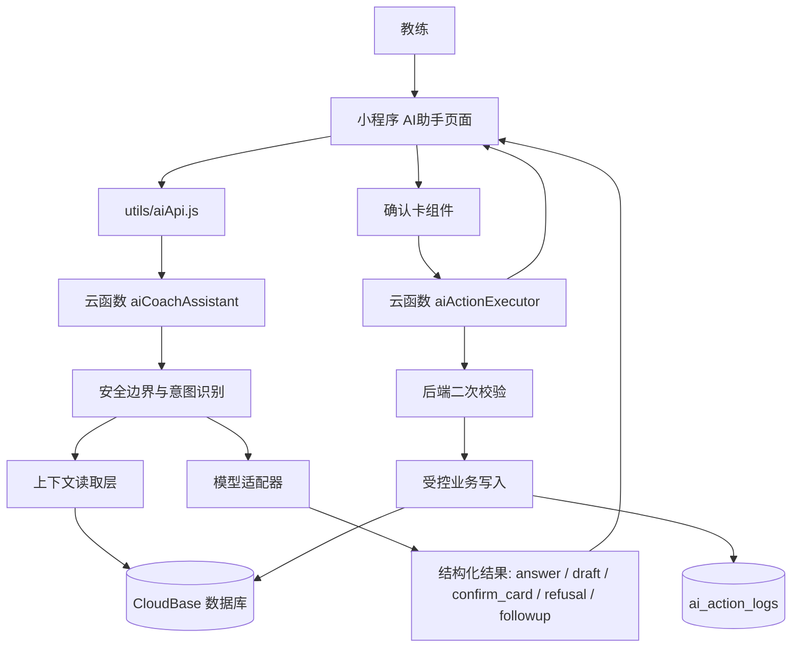

# AI 教练助手系统设计架构 v0.1

> 日期：2026-06-16  
> 输入：`PRD_AI_COACH_ASSISTANT_V0.1.md`  
> 适用项目：微信小程序原生 + CloudBase 云开发  
> 目标：作为后续 vibe coding 的架构参照和分任务边界  
> 产品边界：教练单人模式，不重新开放学生端

---

## 1. 讨论结论

### 1.1 推荐主方案

采用“AI 首页 + 云函数 AI 编排层 + 受控业务工具 + 确认卡执行层”的架构。

核心判断：

- 小程序端负责聊天 UI、今日摘要、快捷指令、卡片展示、确认/取消交互。
- AI 意图识别、上下文读取、安全边界、业务校验和工具编排放到云函数侧。
- 模型不能直接写数据库。
- 前端不能因为拿到了确认卡 payload 就直接写核心业务数据。
- 所有 AI 写入动作都必须进入确认卡，并由云函数二次校验后执行。
- 课时资产、完课扣课时、删除数据、自动通知等高风险动作不开放给 AI，即使用户确认也不执行。

### 1.2 为什么不把 AI 逻辑放在一个前端页面里

当前项目已有 `utils/api.js` 直接访问数据库的模式，适合传统页面的普通查询和表单操作。但 AI 场景多了三类风险：

- 模型可能误解用户意图。
- 用户确认前后 payload 可能被篡改。
- 写入动作需要统一审计和严格权限校验。

因此 AI 触发的写入必须收敛到云函数，使用 `cloud.getWXContext().OPENID` 识别当前教练，并在后端重新查询和校验业务数据。

### 1.3 模型接入策略

第一阶段推荐复用现有云函数模型调用思路，建设统一 `aiCoachAssistant` 云函数作为 AI 网关。当前 `parseTrainingRecord` 可以保留为过渡能力，但后续应迁移为 AI 工具之一，不继续扩成巨型函数。

如果后续改用小程序端 `wx.cloud.extend.AI` 直连模型，需要先满足：

- 微信基础库升级到支持 `wx.cloud.extend.AI` 的版本。
- 先完成 AI 资源资格检查和模型组就绪检查。
- `createModel(provider)` 的参数只能是模型组，如 `cloudbase`、`hunyuan-exp` 或 `custom-*`，不能写成具体模型名。

当前 `project.config.json` 的 `libVersion` 是 `2.20.0`，所以架构上不把小程序端直连模型作为默认依赖。

---

## 2. 当前系统基线

### 2.1 现有前端结构

```text
miniprogram/
├── app.js
├── app.json
├── custom-tab-bar/
├── pages/
│   ├── index/
│   ├── coach/
│   │   ├── lessons/
│   │   ├── students/
│   │   ├── student-detail/
│   │   ├── settings/
│   │   └── training-record/
│   └── common/login-guide/
├── components/
└── utils/
    ├── api.js
    ├── date.js
    └── role.js
```

当前底部 Tab：

```text
日程 | 学员 | 我的
```

AI 版本目标 Tab：

```text
AI助手 | 日程 | 学员 | 我的
```

### 2.2 现有云函数

```text
cloudfunctions/
├── getOpenid/
├── initUser/
├── adjustLessonBalance/
├── completeLesson/
└── parseTrainingRecord/
```

其中：

- `completeLesson` 已负责完课、扣课时、写课时日志的事务。
- `adjustLessonBalance` 负责课时调整。
- `parseTrainingRecord` 是当前训练记录 AI 解析雏形。

AI 架构必须尊重现有约束：

- 完课扣课时继续由 `completeLesson` 事务控制。
- 训练记录按 `lesson_id` upsert。
- 学员、课程、训练记录均按当前教练 `coach_openid` 隔离。
- 学生端不作为当前产品入口。

---

## 3. 总体架构



### 3.1 分层职责

| 层 | 职责 | 不负责 |
| --- | --- | --- |
| AI 首页 | 输入、消息列表、今日摘要、快捷指令、卡片展示、用户确认 | 直接写核心业务数据 |
| AI 编排云函数 | 意图识别、安全判断、上下文读取、调用模型、生成结构化输出 | 绕过确认执行写入 |
| 工具层 | 查询课程/学员/训练记录/统计，准备确认卡 | 由模型自由拼数据库语句 |
| 执行层 | 根据确认卡 action 执行写入，重新校验权限和业务规则 | 接受未经登记或未经校验的 payload |
| 日志层 | 记录 AI 调用、确认卡、执行结果、错误 | 存储敏感联系方式全文或全量导出 |

---

## 4. 前端设计

### 4.1 新增页面

建议新增：

```text
miniprogram/pages/coach/ai-assistant/
├── ai-assistant.js
├── ai-assistant.wxml
├── ai-assistant.wxss
└── ai-assistant.json
```

页面职责：

- 默认作为教练登录后的首页。
- 展示今日摘要。
- 展示对话消息、草稿卡、确认卡、结果卡。
- 支持文本输入。
- 支持语音输入入口。
- 支持快捷指令横向滚动。
- 支持跳转日程、学员、训练记录等传统页面。

### 4.2 Tab 调整

`miniprogram/app.json`：

```json
{
  "tabBar": {
    "custom": true,
    "list": [
      { "pagePath": "pages/coach/ai-assistant/ai-assistant", "text": "AI助手" },
      { "pagePath": "pages/coach/lessons/lessons", "text": "日程" },
      { "pagePath": "pages/coach/students/students", "text": "学员" },
      { "pagePath": "pages/coach/settings/settings", "text": "我的" }
    ]
  }
}
```

`custom-tab-bar/index.js` 同步增加 AI 助手 Tab，并把选中索引调整为：

```text
0 AI助手
1 日程
2 学员
3 我的
```

传统页面 `onShow` 中的 `setSelected()` 也需要同步索引。

### 4.3 前端状态模型

页面内消息对象建议统一为：

```js
{
  id: "local-msg-id",
  role: "user | assistant | system",
  type: "text | answer | followup | draft_card | confirm_card | result_card | refusal",
  text: "",
  card: null,
  created_at: 1710000000000,
  status: "sending | done | failed"
}
```

确认卡结构由后端返回，前端只负责展示，不自行推导业务字段。

### 4.4 前端工具封装

建议新增：

```text
miniprogram/utils/aiApi.js
miniprogram/utils/aiCards.js
```

`aiApi.js`：

- `sendAiMessage({ text, sourceContext })`
- `executeAiAction({ confirmationId })`
- `getAiTodaySummary()`
- `getAiStatus()`

`aiCards.js`：

- 统一卡片类型常量。
- 卡片按钮文案映射。
- 跳转目标映射。
- 前端展示字段格式化。

---

## 5. 云函数设计

### 5.1 云函数清单

建议新增：

```text
cloudfunctions/
├── aiCoachAssistant/       # AI 编排入口
├── aiActionExecutor/       # 确认后执行入口
├── aiTodaySummary/         # 首页摘要，可并入 aiCoachAssistant
└── aiVoiceTranscribe/      # 语音转文字，方案确认后实现
```

可保留并逐步迁移：

```text
cloudfunctions/parseTrainingRecord/
```

### 5.2 aiCoachAssistant

入参：

```js
{
  text: "给王小明明天下午3点排课",
  inputType: "text | voice",
  sourceContext: {
    source: "ai_home | student_detail | lesson_card | training_record",
    student_id: "",
    lesson_id: ""
  },
  clientTime: "2026-06-16T10:00:00+10:00"
}
```

处理流程：

```text
1. 获取 OPENID。
2. 校验当前用户是 coach。
3. 规范化输入和来源上下文。
4. 规则层先识别严禁操作、高风险健康、无关问题。
5. 调用模型做意图识别和参数抽取。
6. 根据意图调用只读工具读取业务上下文。
7. 对写入类生成确认卡，不执行写入。
8. 对查询类生成回答。
9. 记录 ai_call_logs。
10. 返回结构化响应。
```

返回：

```js
{
  success: true,
  messageId: "ai_msg_xxx",
  type: "answer | followup | draft_card | confirm_card | refusal | result_card",
  text: "已为你整理...",
  card: {},
  usage: {
    model: "xxx",
    prompt_tokens: 0,
    completion_tokens: 0
  }
}
```

### 5.3 aiActionExecutor

入参：

```js
{
  confirmationId: "confirm_xxx"
}
```

不建议让前端再次提交完整 payload。前端只传确认卡 ID，后端从 `ai_confirmations` 读取原始 payload，防止确认内容被前端篡改。

处理流程：

```text
1. 获取 OPENID。
2. 读取 ai_confirmations。
3. 校验 confirmation 属于当前教练且状态为 pending。
4. 根据 action_type 分发到受控执行器。
5. 执行前重新查询业务数据。
6. 重新校验所有权、状态、课时、冲突、已有记录。
7. 执行写入。
8. 更新 confirmation 状态。
9. 写 ai_action_logs。
10. 返回结果卡。
```

### 5.4 受控执行器

允许的执行器：

| action_type | 执行器 | 说明 |
| --- | --- | --- |
| `create_lesson` | `executeCreateLesson` | 创建单节课程 |
| `update_lesson` | `executeUpdateLesson` | 修改待上课程时间/地点 |
| `cancel_lesson` | `executeCancelLesson` | 取消待上课程 |
| `save_training_record` | `executeSaveTrainingRecord` | 保存或覆盖训练记录 |
| `append_training_record` | `executeAppendTrainingRecord` | 追加训练记录 |
| `update_student_note` | `executeUpdateStudentNote` | 更新学员备注 |

不允许的执行器：

```text
adjust_lesson_balance
complete_lesson
delete_student
delete_training_records
send_external_message
export_all_data
modify_ai_config
```

完课扣课时继续由传统日程页调用 `completeLesson`，不开放给 AI。

---

## 6. AI 工具协议

### 6.1 工具分为三类

```text
read_tools       只读查询，可直接用于回答
prepare_tools    生成草稿/确认卡，不写数据库
execute_tools    确认后由 aiActionExecutor 调用
```

### 6.2 只读工具

| 工具 | 输入 | 输出 |
| --- | --- | --- |
| `get_today_lessons` | date | 今日课程列表 |
| `get_lessons_by_range` | startDate, endDate, status | 时间范围课程 |
| `get_student_by_name` | name | 候选学员列表 |
| `get_student_detail` | student_id | 学员基础信息 |
| `get_student_recent_training` | student_id, limit | 最近课程与训练记录 |
| `get_low_balance_students` | threshold | 低课时学员 |
| `get_missing_training_records` | range | 已完成未记录课程 |
| `get_operation_stats` | range | 周/月运营统计 |

### 6.3 准备工具

| 工具 | 输出 |
| --- | --- |
| `prepare_create_lesson` | 排课确认卡 |
| `prepare_training_record` | 训练记录草稿卡 |
| `prepare_update_lesson` | 改课确认卡 |
| `prepare_cancel_lesson` | 取消课程确认卡 |
| `prepare_student_note_update` | 备注更新确认卡 |

### 6.4 工具返回原则

工具返回必须是结构化 JSON，不返回自由文本作为执行依据。

示例：

```js
{
  ok: true,
  data: {
    student: { _id: "xxx", name: "王小明", remaining_lessons: 8 },
    lesson: null,
    conflicts: []
  },
  evidence: [
    { type: "student", id: "xxx", label: "王小明，剩余8课时" }
  ]
}
```

---

## 7. 确认卡协议

### 7.1 确认卡必须服务端落库

建议新增集合 `ai_confirmations`。

字段：

```js
{
  _id: "confirm_xxx",
  coach_openid: "openid",
  status: "pending | confirmed | cancelled | expired | executed | failed",
  action_type: "create_lesson",
  title: "确认排课",
  summary: "给王小明创建 2026-06-17 15:00 的课程",
  display_fields: [
    { label: "学员", value: "王小明" },
    { label: "时间", value: "2026-06-17 15:00-16:00" },
    { label: "地点", value: "工作室" }
  ],
  payload: {
    student_id: "xxx",
    date: "2026-06-17",
    start_time: "15:00",
    end_time: "16:00",
    location: "工作室"
  },
  validation_snapshot: {
    remaining_lessons: 8,
    conflict_count: 0
  },
  source_input: "给王小明明天下午3点排一节课",
  source_transcript: "",
  expires_at: Date,
  created_at: Date,
  updated_at: Date
}
```

### 7.2 确认卡执行规则

- 前端只展示 `display_fields` 和按钮。
- 前端点击确认只提交 `confirmationId`。
- 后端执行前必须重新校验，不信任 `validation_snapshot`。
- 过期确认卡不能执行。
- 已执行确认卡不能重复执行。
- 执行失败时返回明确原因，不让模型重新编造。

### 7.3 确认卡类型

| card_type | action_type | 是否写库 |
| --- | --- | --- |
| `schedule_confirm_card` | `create_lesson` | 是 |
| `training_record_draft_card` | `save_training_record` | 是 |
| `lesson_update_confirm_card` | `update_lesson` | 是 |
| `lesson_cancel_confirm_card` | `cancel_lesson` | 是 |
| `student_note_confirm_card` | `update_student_note` | 是 |
| `analysis_card` | 无 | 否 |
| `stats_card` | 无 | 否 |

---

## 8. 数据模型

### 8.1 复用现有集合

```text
users
students
lessons
training_records
lesson_card_logs
coach_settings
```

### 8.2 新增集合

#### ai_conversations

用于保存会话概要和最近消息。第一阶段可以只保存最近若干条，避免无限增长。

```js
{
  coach_openid: "openid",
  title: "今日对话",
  last_message: "今天还有几节课？",
  message_count: 8,
  created_at: Date,
  updated_at: Date
}
```

#### ai_messages

```js
{
  conversation_id: "xxx",
  coach_openid: "openid",
  role: "user | assistant | system",
  type: "text | answer | card | refusal | followup",
  text: "",
  card_ref: "confirm_xxx",
  source_context: {},
  created_at: Date
}
```

#### ai_confirmations

保存确认卡和执行 payload。

#### ai_call_logs

```js
{
  coach_openid: "openid",
  request_type: "intent | answer | parse_training",
  input_length: 42,
  intent: "create_lesson",
  model: "configured-model",
  success: true,
  error_message: "",
  usage: {},
  latency_ms: 1200,
  created_at: Date
}
```

#### ai_action_logs

```js
{
  coach_openid: "openid",
  confirmation_id: "confirm_xxx",
  action_type: "create_lesson",
  target_type: "lesson",
  target_id: "lesson_xxx",
  success: true,
  error_message: "",
  created_at: Date
}
```

#### student_ai_summaries

后期可选，不建议第一阶段强依赖。

```js
{
  coach_openid: "openid",
  student_id: "student_xxx",
  summary: "最近训练以胸背为主...",
  source_lesson_ids: [],
  source_record_ids: [],
  refreshed_at: Date,
  created_at: Date,
  updated_at: Date
}
```

---

## 9. 意图与响应类型

### 9.1 意图枚举

```js
const AI_INTENTS = {
  QUERY_TODAY_LESSONS: "query_today_lessons",
  QUERY_STUDENT: "query_student",
  QUERY_STATS: "query_stats",
  CREATE_LESSON: "create_lesson",
  UPDATE_LESSON: "update_lesson",
  CANCEL_LESSON: "cancel_lesson",
  CREATE_TRAINING_RECORD: "create_training_record",
  ANALYZE_STUDENT: "analyze_student",
  OPERATION_REVIEW: "operation_review",
  FITNESS_GENERAL: "fitness_general",
  HEALTH_RISK: "health_risk",
  OUT_OF_SCOPE: "out_of_scope",
  FORBIDDEN: "forbidden",
  AMBIGUOUS: "ambiguous"
};
```

### 9.2 响应类型

```js
const AI_RESPONSE_TYPES = {
  ANSWER: "answer",
  FOLLOWUP: "followup",
  DRAFT_CARD: "draft_card",
  CONFIRM_CARD: "confirm_card",
  RESULT_CARD: "result_card",
  REFUSAL: "refusal",
  ERROR: "error"
};
```

---

## 10. 核心流程

### 10.1 查询今日日程

```text
用户输入
-> aiCoachAssistant
-> 识别 query_today_lessons
-> get_today_lessons
-> get_missing_training_records
-> get_low_balance_students
-> 生成 answer/stats_card
-> 前端展示
```

### 10.2 AI 排课

```text
用户输入
-> 识别 create_lesson
-> 抽取 student_name/date/start_time/location
-> 缺字段则 followup
-> get_student_by_name
-> get_lessons_by_range 检查冲突
-> get_coach_settings 获取默认时长/地点
-> prepare_create_lesson
-> 写 ai_confirmations
-> 返回 confirm_card
-> 用户确认
-> aiActionExecutor
-> 重新校验学员归属、课时、冲突
-> 创建 lessons
-> 写 ai_action_logs
-> 返回 result_card
```

### 10.3 AI 训练记录

```text
用户输入
-> 识别 create_training_record
-> 匹配 student/lesson
-> 缺 student 或 lesson 则追问
-> 模型解析训练结构
-> prepare_training_record
-> 返回 draft_card 或 confirm_card
-> 用户确认保存
-> aiActionExecutor
-> 重新校验 lesson 属于当前教练
-> 检查是否已有 training_record
-> upsert training_records
-> 返回 result_card
```

### 10.4 学员分析

```text
用户输入
-> 识别 analyze_student
-> get_student_by_name
-> get_student_recent_training
-> 数据不足检查
-> 模型生成分析
-> 回答中展示依据
```

---

## 11. 安全边界

### 11.1 规则层先于模型执行

以下输入应先由规则层拦截，不依赖模型自由判断：

- 扣课时、充值课时、批量调整课时。
- 自动完成课程并扣课时。
- 删除学员、删除课程、清空训练记录。
- 自动发微信消息或通知学员。
- 修改系统配置、AI 配置、数据库权限。
- 导出全量数据。

### 11.2 写入类必须确认

只要写入以下集合，就必须确认：

```text
lessons
training_records
students
```

不开放 AI 写入：

```text
lesson_card_logs
coach_settings
users
```

例外：`lesson_card_logs` 只能由已有 `completeLesson`、`adjustLessonBalance` 等受控业务函数写入，AI 不新增入口。

### 11.3 后端二次校验

所有写入执行器必须校验：

- 当前用户是教练。
- 目标资源 `coach_openid` 等于当前 `OPENID`。
- 学员存在。
- 课程存在。
- 课程状态允许修改。
- 排课时间无冲突。
- 创建课程时学员剩余课时大于 0。
- 保存训练记录时课程归属正确。

---

## 12. 语音输入设计

### 12.1 第一阶段

保留现有录音 UI，语音转文字能力可先作为独立云函数或插件能力接入，但转写后必须进入与文本相同的 AI 流程。

### 12.2 语音写入规则

写入类确认卡必须展示：

```text
我听到的是：……
```

并把转写原文保存到 `source_transcript`。

### 12.3 降级

语音不可用时：

- 文本输入仍可用。
- 训练记录页仍可手动填写。
- AI 首页提示“语音暂不可用，请输入文字”。

---

## 13. 模型提示词与结构化输出

### 13.1 模型只输出结构化决策

不建议让模型直接返回散文式回答后由代码正则解析。模型输出应约束为：

```js
{
  intent: "create_lesson",
  confidence: 0.86,
  safety: {
    level: "normal | write | forbidden | health_risk | out_of_scope",
    requires_confirmation: true
  },
  slots: {},
  response_plan: {
    type: "confirm_card",
    missing_fields: [],
    answer_brief: ""
  }
}
```

### 13.2 数据回答必须带依据

分析类响应内部应保留 evidence：

```js
{
  answer: "基于最近 4 条训练记录...",
  evidence: [
    { type: "training_record", id: "xxx", label: "6/10 胸部" }
  ]
}
```

前端可选择展示简要依据，详细依据用于调试和审计。

---

## 14. 目录演进建议

### 14.1 小程序端

```text
miniprogram/
├── pages/coach/ai-assistant/
├── components/ai/
│   ├── ai-message-list/
│   ├── ai-confirm-card/
│   ├── ai-draft-card/
│   └── ai-quick-actions/
└── utils/
    ├── aiApi.js
    ├── aiCards.js
    └── aiConstants.js
```

### 14.2 云函数端

```text
cloudfunctions/aiCoachAssistant/
├── index.js
├── package.json
├── config.json
└── lib/
    ├── intent.js
    ├── safety.js
    ├── modelAdapter.js
    ├── tools.js
    ├── cards.js
    └── logger.js

cloudfunctions/aiActionExecutor/
├── index.js
├── package.json
├── config.json
└── lib/
    ├── validators.js
    ├── executeCreateLesson.js
    ├── executeUpdateLesson.js
    ├── executeCancelLesson.js
    ├── executeSaveTrainingRecord.js
    └── executeUpdateStudentNote.js
```

---

## 15. 构建检查点

### Checkpoint 1：AI 首页骨架

验收：

- `AI助手` 成为第一个 Tab。
- 页面展示今日摘要占位、快捷指令、输入框和消息列表。
- 传统日程、学员、我的页面仍可进入。

### Checkpoint 2：AI 编排云函数骨架

验收：

- `aiCoachAssistant` 能接收文本并返回固定结构。
- 能识别无关问题、严禁操作和简单查询。
- 写入类只返回确认卡，不执行写入。

### Checkpoint 3：查询类能力

验收：

- 能回答今天课程、低课时学员、未写训练记录、本周课程数。
- 回答只基于数据库。
- 数据不足时明确说明。

### Checkpoint 4：确认卡基础设施

验收：

- 确认卡服务端落库。
- 前端确认只传 `confirmationId`。
- 过期、重复、非本人确认卡不能执行。

### Checkpoint 5：排课 Agent

验收：

- 自然语言生成排课确认卡。
- 后端执行前校验学员、课时、时间冲突。
- 确认后创建 `lessons`。

### Checkpoint 6：训练记录 Agent

验收：

- 自然语言生成结构化训练记录草稿。
- 确认后按 `lesson_id` upsert。
- 已有记录时明确提示覆盖或追加。

### Checkpoint 7：学员分析和运营复盘

验收：

- 能总结学员最近训练。
- 能总结本周/本月运营。
- 回答展示依据，不编造缺失数据。

### Checkpoint 8：语音输入

验收：

- 语音转文字进入统一 AI 流程。
- 写入确认卡展示转写原文。
- 语音失败可回退文本。

### Checkpoint 9：设置与降级

验收：

- 我的页展示 AI 可用状态。
- 模型不可用、额度不足、语音不可用时有明确降级。
- 传统流程不受 AI 失败影响。

---

## 16. 验证策略

### 16.1 静态检查

- JSON 文件可解析。
- 所有新增 JS 文件通过 `node --check`。
- `app.json` 注册页面均有 `.js/.json/.wxml/.wxss`。
- 搜索确认没有重新注册学生端页面。

### 16.2 业务路径检查

必须覆盖：

- 打开小程序默认进入 AI 助手。
- 查询今日日程。
- 生成排课确认卡。
- 确认排课后创建课程。
- 生成训练记录草稿。
- 保存训练记录后可在课程/学员详情回看。
- 严禁操作拒绝且不生成确认卡。
- 无关问题拒答。
- AI 失败后传统页面仍可用。

### 16.3 数据一致性检查

- AI 创建课程不能绕过 0 课时校验。
- AI 不能调用完课扣课时。
- 训练记录同一 `lesson_id` 不重复新增多条。
- 确认卡不能重复执行。
- 非本人资源不能通过 confirmation 执行。

---

## 17. 已确认决策

以下决策作为第一阶段 vibe coding 的默认实现边界。后续如果产品验证后需要升级，可以在不推翻主架构的前提下替换局部实现。

1. AI 会话历史保存最近 20 条消息，并记录 AI 调用日志；第一阶段不保存完整长期聊天历史。
2. 语音转文字预留 `aiVoiceTranscribe` 云函数接口，第一阶段不作为核心链路依赖；文本 AI 工作台先跑通。
3. 模型接入第一阶段继续使用云函数内 OpenAI-compatible 配置，并封装为 `modelAdapter`；后续可切换 CloudBase AI managed group。
4. 确认卡默认有效期为 15 分钟。
5. 同名学员不自动猜测，必须让教练选择候选学员后再继续。
6. 地点缺失时优先使用学员偏好地点，其次使用教练常用地点；确认卡必须明确展示最终地点。
7. 学员 AI 摘要缓存第一阶段不做，先基于实时课程和训练记录生成分析。
8. 第一阶段只做当前 AI 工作台会话，不做多会话列表。
9. AI 不开放课时充值、扣减、批量调整、自动完课扣课时、删除数据和自动通知学员。
10. 写入类确认卡必须服务端落库；前端确认时只提交 `confirmationId`，不提交完整业务 payload。

---

## 18. 第一批 vibe coding 任务建议

建议按以下顺序开工。每一批都要保持传统页面可独立工作，AI 失败不能阻断原有教练主流程。

### 18.1 AI 首页和导航骨架

- 新增 `miniprogram/pages/coach/ai-assistant/` 页面。
- 将 `AI助手` 加为第一个 Tab，保持 `日程 | 学员 | 我的` 继续可用。
- 更新 `custom-tab-bar/index.js` 的 tab 列表和选中索引。
- 更新入口分发逻辑，让已注册教练默认进入 AI 助手。
- 页面先实现今日摘要占位、消息列表、快捷指令、文本输入框和发送按钮。

验收：

- 打开小程序后教练进入 AI 助手。
- 四个 Tab 都能切换。
- 日程、学员、我的页面没有因为索引变化出现选中错误。

### 18.2 前端 AI 调用封装

- 新增 `miniprogram/utils/aiApi.js`。
- 提供 `sendAiMessage`、`executeAiAction`、`getAiTodaySummary` 三个入口。
- AI 助手页只依赖 `aiApi.js`，不直接调用具体云函数。
- 第一批可先接固定 mock 返回，便于 UI 联调。

验收：

- 输入文字后能追加用户消息和 AI mock 消息。
- 云函数失败时能展示错误消息，不影响页面继续输入。

### 18.3 `aiCoachAssistant` 云函数骨架

- 新增 `cloudfunctions/aiCoachAssistant/`。
- 使用 `cloud.getWXContext().OPENID` 获取当前教练身份。
- 支持基础规则拦截：严禁操作、无关问题、高风险健康问题。
- 支持最小查询能力：今日课程、低课时学员、未写训练记录。
- 写入类请求只返回确认卡，不执行写入。
- 日志先记录到 `ai_call_logs`，如果集合未建则降级为 `console.log`。

验收：

- “今天还有几节课？”能返回基于数据库的回答。
- “帮我扣李雷10节课”返回拒绝，不生成确认卡。
- “帮我写一首诗”返回业务边界拒答。

### 18.4 确认卡和执行器基础设施

- 新增 `ai_confirmations` 数据结构和保存逻辑。
- 新增 `cloudfunctions/aiActionExecutor/`。
- 前端确认按钮只传 `confirmationId`。
- 执行器校验确认卡属于当前教练、状态为 `pending`、未过期。
- 确认卡执行后更新为 `executed`，重复点击不能重复写入。

验收：

- 过期确认卡不能执行。
- 已执行确认卡不能再次执行。
- 非本人确认卡不能执行。

### 18.5 排课 Agent 闭环

- 支持自然语言排课意图和字段抽取。
- 根据学员姓名匹配学员；同名时返回候选选择。
- 地点缺失时按“学员偏好地点 -> 教练常用地点”的顺序补齐。
- 生成排课确认卡。
- 确认后重新校验学员归属、剩余课时和时间冲突，再创建 `lessons`。

验收：

- “给王小明明天下午3点排课”能生成确认卡。
- 0 课时学员不能创建课程。
- 冲突时间不能创建课程。
- 确认成功后日程页可看到新课程。

### 18.6 训练记录 Agent 闭环

- 支持自然语言训练记录解析。
- 优先匹配来源上下文里的 `lesson_id`，其次按学员和日期匹配课程。
- 缺少学员或课程时追问，不猜测。
- 生成训练记录草稿卡。
- 确认保存后按 `lesson_id` upsert `training_records`。
- 已有记录时先让用户选择覆盖或追加。

验收：

- “记录李雷今天练背...”能生成结构化草稿。
- 保存后训练记录页和学员详情可回看。
- 同一节课不会重复新增多条训练记录。

### 18.7 分析、复盘和语音后置

- 在主链路稳定后接入学员分析和运营复盘。
- 分析必须展示数据依据，数据不足时明确说明。
- 语音转文字只作为输入增强，转写后仍进入统一 `sendAiMessage` 流程。

验收：

- “王小明最近练得怎么样？”基于最近课程和训练记录回答。
- “总结这周工作”返回课程数、未记录数、低课时学员等统计。
- 语音失败时文本输入仍可完整使用。
