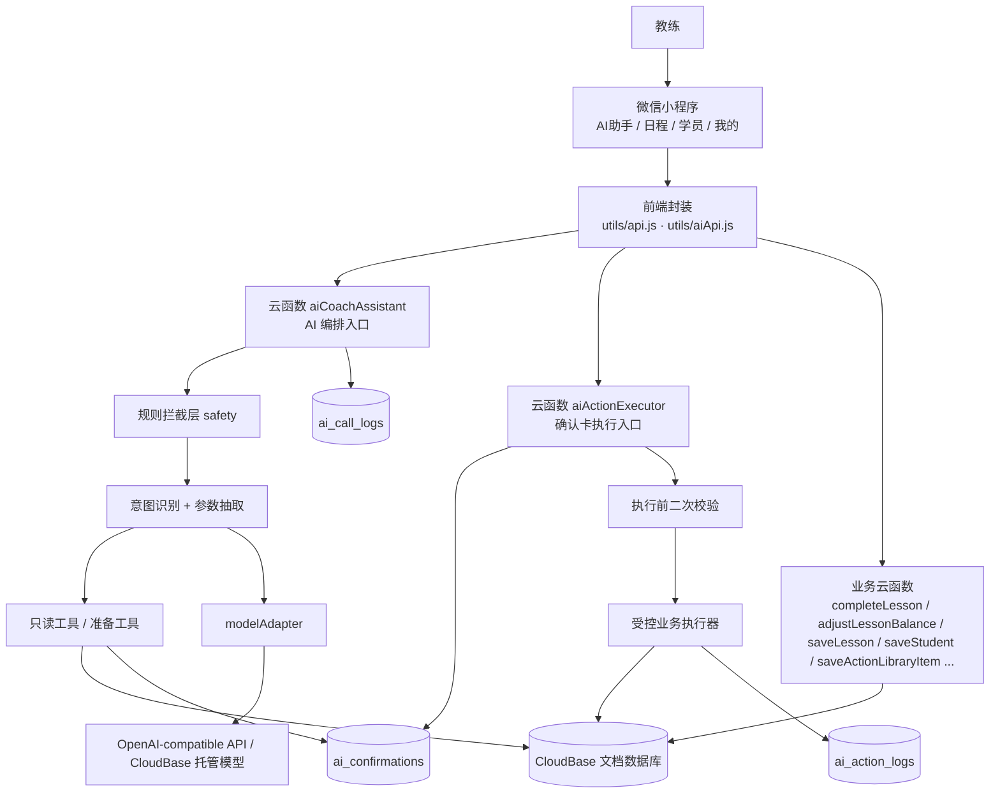

# AI 教练助手 v0.2 整合技术架构与 Vibe Coding 指导文档

> 日期：2026-06-25
> 性质：前端架构 + 后端架构整合稿，作为后续 vibe coding 的唯一技术指导文档
> 目标平台：微信小程序原生 + 微信云开发 / CloudBase
> 输入来源：
> - `PRD_AI_COACH_ASSISTANT_V0.2.md`（产品需求，第一版边界）
> - `FRONTEND_ARCHITECTURE_AI_COACH_ASSISTANT_V0.2.md`（前端架构）
> - `BACKEND_ARCHITECTURE_AI_COACH_ASSISTANT_V0.2.md`（后端架构）
> - `SYSTEM_DESIGN_AI_COACH_ASSISTANT_V0.1.md` / `PRD_AI_COACH_ASSISTANT_V0.1.md`（仅作参考，按全新产品重做）
> - 微信小程序与 CloudBase 官方 skill 知识库（miniprogram-development、cloudbase-guidelines、ai-model-wechat、auth-wechat、no-sql-wx-mp-sdk、cloud-functions、CloudBase-MCP）
> 本文关系：本文**整合并取代**前端架构文档和后端架构文档作为实现依据；PRD 仍是产品边界的最终来源，本文与 PRD 冲突时以 PRD 为准。

---

## 0. 如何使用本文档

### 0.1 标记规则

| 标记 | 含义 |
| --- | --- |
| 已确认 | 来自 PRD 或前后端架构文档，可直接进入实现 |
| 补充 | 本次整合新增或澄清的内容，用于查漏补缺，作为默认实现边界 |
| 第一版不做 | 明确排除，避免 scope creep |

凡标记 `补充` 的条目，集中收录在 `第 16 章 查漏补缺清单`，正文出现处会内联标注。

### 0.2 全局实现原则（必须遵守）

- `AI助手` 是默认入口；`日程`、`学员`、`我的` 是兜底操作与数据回看。
- 所有写入类动作必须先生成确认卡，确认后由云函数二次校验执行：排课、训练方案、课程训练总结、完课扣减、课时调整。
- AI 不能直接写数据库，只能生成回答、追问、草稿卡、确认卡。
- 课时资产、删除数据、自动通知、自动完课扣课时不开放给 AI，即使用户在对话里要求也拒绝。
- 语音转写结果先进入输入框，用户可改后再发送；第一版不做录完自动发送。
- 学员端不开放，前端不得出现学员预约、学员确认、学员自助查看入口。
- 身份只来自 `cloud.getWXContext().OPENID`，不接受前端传入 `coach_openid` / `_openid`。
- AI 失败、语音失败时，传统手动流程必须仍然可用。

---

## 1. 架构总览

### 1.1 总体架构图



### 1.2 分层职责

| 层级 | 职责 | 禁止 |
| --- | --- | --- |
| 小程序端 | 展示消息、录音、提交文本、展示确认卡、提交确认动作、传统页面兜底操作 | 持有模型密钥、直接执行 AI 写入、信任本地 payload 写库 |
| AI 编排层 `aiCoachAssistant` | 规则拦截、意图识别、读业务数据、生成草稿与确认卡、落库 `ai_confirmations` | 直接写核心业务集合 |
| 受控执行层 `aiActionExecutor` | 按确认卡白名单动作二次校验并写库 | 接受模型临时生成的任意动作、接受前端完整业务 payload |
| 业务云函数层 | 完课扣减、课时调整、手动排课/改课/取消、学员维护、动作库维护 | 把课时资产写入暴露给 AI |
| 数据层 | 保存业务数据、确认卡、日志、动作库 | 依赖前端传入归属字段 |
| 模型适配层 `modelAdapter` | 统一调用模型、记录 usage/错误/超时、可切换 provider | 把业务权限判断交给模型 |

---

## 2. 工程基线与环境配置（补充）

> 前后端文档均未给出可直接落地的工程基线。本章补齐 vibe coding 启动所需的最小配置，避免第一次构建即失败。

### 2.1 基础约定

| 项 | 取值 / 说明 |
| --- | --- |
| 框架 | 微信小程序原生（不引入 uni-app / Taro） |
| 后端 | 微信云开发（CloudBase），云函数运行时 Node.js（建议 16+） |
| 云函数 SDK | `wx-server-sdk`（微信云开发标准；如用 CloudBase 独立环境则用 `@cloudbase/node-sdk`，二选一并全局统一） |
| 基础库 `libVersion` | 建议 `3.x`（≥ 3.7.1）。原因：① 同声传译插件兼容性好；② 为后续可选的 `wx.cloud.extend.AI` 直连预留空间。第一版 AI 走后端网关，不强依赖该能力 |
| 环境隔离 | 至少一个云开发环境 `env`，在 `app.js` 显式 `wx.cloud.init({ env })`，**不依赖默认环境** |
| 时区 | 统一以 `coach_settings.timezone`（默认 `Australia/Sydney`）解析自然语言时间 |

### 2.2 `project.config.json` 关键字段

```json
{
  "appid": "<你的小程序 appid>",
  "projectname": "ai-coach-assistant",
  "miniprogramRoot": "miniprogram/",
  "cloudfunctionRoot": "cloudfunctions/",
  "compileType": "miniprogram",
  "setting": { "urlCheck": true, "es6": true, "minified": true }
}
```

### 2.3 `app.js` 初始化

```js
App({
  globalData: { env: "<你的云开发环境ID>", coach: null },
  onLaunch() {
    if (!wx.cloud) {
      console.error("当前基础库不支持云开发，请升级基础库");
      return;
    }
    wx.cloud.init({ env: this.globalData.env, traceUser: true });
  }
});
```

### 2.4 同声传译插件声明（语音转写第一版方案，补充）

`app.json` 中声明插件（同声传译 WechatSI，appid 固定为 `wx069ba97219f66d99`）：

```json
{
  "plugins": {
    "WechatSI": { "version": "0.3.5", "provider": "wx069ba97219f66d99" }
  },
  "permission": {
    "scope.record": { "desc": "用于语音输入记录训练、排课等指令" }
  },
  "requiredPrivateInfos": []
}
```

> 插件版本号以微信公众平台“插件管理”中可用的最新稳定版为准，需先在公众平台添加该插件。

### 2.5 统一目录结构（整合前后端 + 0.1）

```text
miniprogram/
├── app.js / app.json / app.wxss
├── custom-tab-bar/                 # 文字型四 Tab
├── pages/
│   └── coach/
│       ├── ai-assistant/           # Tab1 默认入口
│       ├── lessons/                # Tab2 日程（日/周/月）
│       ├── lesson-detail/          # 课程详情（二级）
│       ├── lesson-form/            # 手动排课/改课（二级）
│       ├── students/               # Tab3 学员列表
│       ├── student-detail/         # 学员详情（概览/课程/总结/数据/备注）
│       ├── training-summary-detail/# 课程训练总结详情（二级）
│       ├── settings/               # Tab4 我的
│       └── action-library/         # 动作库管理（二级）
├── components/
│   ├── common/                     # status-tag / segmented-tabs / bottom-sheet / empty-state ...
│   ├── ai/                         # today-summary-panel / message-list / quick-action-strip / chat-input-bar / voice-state-hint / ai-card-renderer / confirm-card / result-card
│   └── business/                   # lesson-row / lesson-card / student-row / training-summary-card / action-normalization-list ...
└── utils/
    ├── api.js                      # 传统业务调用封装
    ├── aiApi.js                    # AI 调用封装
    ├── aiCards.js                  # 卡片类型/按钮/跳转/字段格式化
    ├── aiConstants.js              # 意图、响应类型、卡片类型、错误码常量
    ├── date.js                     # 时间/时区工具
    └── role.js                     # 身份与入口分发

cloudfunctions/
├── getOpenid/                      # 获取 openid（基础）
├── initUser/                       # 教练账户初始化
├── aiCoachAssistant/               # AI 编排入口
│   └── lib/{intent,safety,tools,normalize,cards,modelAdapter,logger}.js
├── aiActionExecutor/               # 确认卡执行入口
│   └── lib/{validators,executeCreateLesson,executeSaveTrainingPlan,executeSaveLessonSummary}.js
├── aiVoiceTranscribe/              # 后端语音识别预留（第一版不启用）
├── completeLesson/                 # 完课确认后扣课时（仅手动）
├── adjustLessonBalance/            # 课时充值/手动扣减（仅手动）
├── saveLesson/                     # 手动排课/改课/取消（仅手动）
├── saveStudent/                    # 学员新增/编辑（仅手动）
└── saveActionLibraryItem/          # 自定义动作与别名维护（仅手动）
```

---

## 3. 信息架构与导航

### 3.1 四 Tab

```text
AI助手 | 日程 | 学员 | 我的
```

- 使用 `custom-tab-bar`，文字型 Tab，第一版不强制图标（减少图标资产与对齐问题）。
- 选中索引固定：`0 AI助手 / 1 日程 / 2 学员 / 3 我的`。

### 3.2 导航 gotcha（补充）

- 每个 Tab 页 `onShow` 必须调用 `getTabBar().setData({ selected })` 同步选中态，索引错位是 custom-tab-bar 最常见 bug。
- 已注册教练登录后默认进入 `AI助手`；入口分发逻辑放在 `utils/role.js`。
- 二级页面（lesson-detail 等）不进入 tabBar，使用 `wx.navigateTo`。

---

## 4. 前端架构

### 4.1 视觉风格

风格关键词：`AI-first / 工具型 / 高信息密度 / 健身行动感 / 克制 / 可扫读`。

| 用途 | 色值 |
| --- | --- |
| 品牌主色 | `#FF6B35` |
| 品牌深色 | `#CC4921` |
| 品牌浅底 | `#FFF0E8` |
| 主文字 | `#1A1A2E` |
| 次级文字 | `#6B7280` |
| 弱文字 | `#9CA3AF` |
| 页面背景 | `#F0F2F5` |
| 卡片背景 | `#FFFFFF` |
| 成功 | `#2D9A4E` |
| 警告 | `#F5A623` |
| 错误 | `#E74C3C` |

布局：浅灰背景 + 白色卡片；圆角 `12rpx`~`24rpx`；列表高信息密度；AI 首页今日状态区可用深色；不使用大插画/渐变装饰；固定底部输入区与 custom-tab-bar 必须处理 safe area（`env(safe-area-inset-bottom)`）。

### 4.2 组件清单

通用：`custom-tab-bar`、`status-tag`、`segmented-tabs`、`bottom-sheet`、`confirm-card`、`result-card`、`empty-state`。
AI：`today-summary-panel`、`message-list`、`quick-action-strip`、`chat-input-bar`、`voice-state-hint`、`ai-card-renderer`。
业务：`lesson-row`、`lesson-card`、`lesson-form`、`lesson-detail-panel`、`student-row`、`student-profile-header`、`training-summary-card`、`action-normalization-list`。

### 4.3 前端状态分层

```text
App 全局：当前教练身份 / 云环境 / Tab 选中
页面状态：当前视图(日/周/月) / 选中日期 / 当前学员·课程 / 表单输入 / 语音状态 / 会话消息
服务端状态：学员 / 课程 / 课时记录 / 训练方案 / 课程训练总结 / 动作库 / 确认卡
```

会话消息对象统一结构：

```js
{
  id: "local-msg-id",
  role: "user | assistant | system",
  type: "text | answer | followup | draft_card | confirm_card | result_card | refusal | error",
  text: "",
  card: null,            // 卡片结构由后端返回，前端只渲染，不自行推导业务字段
  created_at: 1710000000000,
  status: "sending | done | failed"
}
```

确认卡前端规则：

- 状态 `pending / confirmed / cancelled / expired / failed`。
- 过期（15 分钟）后禁用确认按钮。
- 重新进入页面时，若存在未完成确认卡，必须从服务端重新读取状态，不能只信本地缓存（补充：通过 `aiApi.getPendingConfirmations()` 拉取）。

### 4.4 前端工具封装

`utils/aiApi.js`：

- `sendAiMessage({ text, inputType, sourceContext })`
- `executeAiAction({ confirmationId, userEdits })`
- `getTodayContext()`
- `getPendingConfirmations()`（补充）

`utils/api.js`（传统业务，直连云函数）：`getLessonsByRange`、`getStudents`、`getStudentDetail`、`completeLesson`、`adjustLessonBalance`、`saveLesson`、`cancelLesson`、`saveStudent`、`getActionLibrary`、`saveActionLibraryItem`。

`utils/aiCards.js`：卡片类型常量、按钮文案映射、跳转目标映射、展示字段格式化。

### 4.5 各页面交互要点

AI 助手页（结构：今日状态区 / 对话区 / 快捷指令横向滚动 / 底部输入区）：

- 默认开场只做行动引导，不重复今日状态数据。
- 快捷指令（记录训练 / 安排课程 / 查今日课表 / 分析学员）只发送预置意图，进入正常 AI 流程，不绕过确认卡。
- 横向滚动用 `scroll-view scroll-x`。
- 底部输入区固定在 Tab 上方，含文本框（`textarea`）、长按语音按钮、发送按钮。
- 今日状态区不显示待确认 AI 草稿；确认卡/草稿卡/失败任务只在对话区。

日程页（顶部分段 `日 | 周 | 月`）：

- 日视图：紧凑课程行（时间 / 学员 / 主题或方案状态 / 课程或总结状态）；快捷动作仅 `标记完成 / 记录训练 / 取消`；取消课程折叠在底部；`修改课程`放课程详情。
- 周视图：横向周一到周日、纵向时间段、粒度 15 分钟；顶部纯规则统计（本周课程数 / 已完成 / 待上课）；点击空白时段默认打开手动新建课程，并提供 `问 AI 排课` 二级入口；点击课程进详情。
- 月视图：轻量概览（课程数 / 未完成 / 总结未完成数），点击进日视图。
- 课程详情：完整信息 + 低频操作；`标记完成`必须弹完课确认卡。

学员页：

- 列表（搜索 + 添加 + 高密度行 + `低课时`/`总结未完成` 标签 + 默认按最近上课倒序）。
- 详情分段 `概览 | 课程 | 总结 | 数据 | 备注`。
- 课时区：余额 + 不可删除的变动记录；充值/手动扣减为手动操作，AI 不触发。

我的页：账户区 / 默认课时时长 / 动作库管理入口 / 关于与轻量反馈。第一版不展示 AI 模型、额度、语音设置、会员、收入、多教练。

### 4.6 语音输入实现（补充：同声传译插件落地细节）

状态机：`idle → recording → uploading → transcribing → failed`（插件方案中 uploading/transcribing 合并为插件内部处理，对外仍暴露这些状态以兼容后续后端识别）。

推荐实现：

```js
const plugin = requirePlugin("WechatSI");
const recordManager = plugin.getRecordRecognitionManager();

recordManager.onStart = () => setState("recording");
recordManager.onRecognize = (res) => {/* 可选：中间结果 */};
recordManager.onStop = (res) => {
  // res.result 即转写文本；写入输入框，不自动发送
  setInputText(res.result);
  setState("idle");
};
recordManager.onError = () => { setState("failed"); /* 保留已输入文本 */ };

// 长按开始：recordManager.start({ duration: 60000, lang: "zh_CN" })
// 松开结束：recordManager.stop()
// 上滑取消：recordManager.stop() 后丢弃结果
```

规则：最短 1 秒、最长 60 秒；长按录音、上滑取消；转写文本填入输入框可改可清空；首次使用轻量引导；转写失败/AI 失败均保留输入框文本；不长期保留原音频。

异常提示只在异常发生时轻量展示，不常驻、不进我的页配置、不占今日状态区。

---

## 5. 后端架构

### 5.1 云函数清单与边界

| 云函数 | 类型 | 职责 | 是否对 AI 开放 |
| --- | --- | --- | --- |
| `getOpenid` | 基础 | 返回 OPENID | - |
| `initUser` | 基础 | 教练账户初始化（写 `users` + `coach_settings`） | 否 |
| `aiCoachAssistant` | AI | 编排：规则拦截、意图识别、读数据、生成草稿/确认卡 | 入口 |
| `aiActionExecutor` | AI | 执行确认卡白名单动作并二次校验 | 入口 |
| `aiVoiceTranscribe` | AI | 后端语音识别（第一版仅预留） | 预留 |
| `completeLesson` | 业务 | 完课确认 → 扣课时 → 写 `lesson_balance_logs`（事务） | 否（仅手动） |
| `adjustLessonBalance` | 业务 | 课时充值 / 手动扣减 | 否（仅手动） |
| `saveLesson` | 业务 | 手动排课 / 改课 / 取消 | 否（仅手动） |
| `saveStudent` | 业务 | 学员新增 / 编辑 | 否（仅手动） |
| `saveActionLibraryItem` | 业务 | 自定义动作与别名维护 | 否（仅手动） |

> 补充：v0.1 曾把 `update_lesson` / `cancel_lesson` / `update_student_note` 设为 AI 执行器。v0.2 PRD 将“修改课程、取消课程、备注修改”收敛为课程详情/学员详情中的手动操作，因此第一版 AI 写入执行器只保留三个：`create_lesson`、`save_training_plan`、`save_lesson_summary`。改课/取消由 `saveLesson` 手动完成。

### 5.2 `aiCoachAssistant` 入参与流程

入参：

```js
{
  text: "给小王明天下午三点排一节课",
  inputType: "text | voice",
  sourceContext: { source: "ai_home | lesson_detail | student_detail | schedule", student_id: "", lesson_id: "" },
  clientTime: "2026-06-25T15:00:00+10:00"
}
```

流程：

```text
1. 取 OPENID。
2. 校验 users 中存在且 role=coach。
3. 清洗文本，合并 sourceContext。
4. 规则层拦截 forbidden / out_of_scope / health_risk。
5. 模型做意图识别 + 参数抽取，返回结构化 JSON。
6. 校验 intent 在白名单内。
7. 按 intent 调只读工具读业务上下文。
8. 信息不足 → followup。
9. 查询类 → answer / data_card。
10. 写入类 → 生成 confirmation 落库 ai_confirmations。
11. 记录 ai_call_logs。
12. 返回结构化响应（见第 8 章契约）。
```

### 5.3 `aiActionExecutor` 入参与流程

入参：`{ confirmationId, userEdits? }`。

```text
1. 取 OPENID。
2. 读 ai_confirmations。
3. 校验属于当前教练。
4. 校验状态为 pending。
5. 校验未超 15 分钟。
6. 合并受允许的 userEdits（仅 editable_fields）。
7. 按 action_type 分发受控执行器。
8. 执行前重新查库二次校验（学员/课程/冲突/课时/归属）。
9. 写业务数据。
10. 更新 ai_confirmations 状态。
11. 写 ai_action_logs。
12. 返回 result_card。
```

### 5.4 模型适配层 `modelAdapter`（补充：双 provider + 资格检查）

第一版主方案：后端调外部 OpenAI-compatible API；密钥放云函数环境变量，小程序端绝不持有。

```text
LLM_PROVIDER=openai_compatible        # openai_compatible | cloudbase
LLM_BASE_URL=https://api.example.com/v1
LLM_API_KEY=******
LLM_MODEL=deepseek-chat
LLM_TIMEOUT_MS=20000
LLM_TEMPERATURE=0.2
```

`modelAdapter.generateJson({ system, messages, schema })` 统一出口，内部按 provider 分发：

- `openaiCompatibleProvider`：fetch 调外部 API。
- `cloudbaseAiProvider`（补充，后续切换）：云函数内用 `@cloudbase/node-sdk` 的 `app.ai()` 调 CloudBase 托管模型。注意：`createModel(provider)` 的参数是 GroupName（只能是 `"cloudbase"` / `"hunyuan-exp"` / `"custom-*"`），具体模型 id 放在 `model` 字段。切换前需先跑资格检查（`DescribeEnvPostpayPackage` 资源包 / `DescribeActivityInfo` 小程序成长计划）与模型开通（`DescribeAIModels` → `UpdateAIModel`）。第一版不依赖此路径。

为什么不第一版就用小程序端 `wx.cloud.extend.AI` 直连：写入安全仍需后端确认卡 + 二次校验，意图编排集中在后端更稳；直连会让权限校验分散。

### 5.5 时区与自然语言时间解析（补充）

- 服务端解析“今天/明天/下午三点”等表达时，以 `clientTime`（带时区偏移）为基准日，缺失时回退到 `coach_settings.timezone`。
- 模糊时间（“下午”“晚点”）不得直接落库，必须追问到明确的开始/结束时间。
- 落库统一存 `start_at` / `end_at` 为带时区的 `Date`；`date` 冗余存 `YYYY-MM-DD`（按教练时区）便于按天查询。
- 默认结束时间 = 开始时间 + `coach_settings.default_lesson_duration_minutes`，教练可改；粒度 15 分钟。

### 5.6 时间冲突检测算法（补充）

排课/改课冲突判定：对当前教练、状态 ≠ `cancelled` 的课程，存在 `existing.start_at < new.end_at AND existing.end_at > new.start_at` 即为冲突。改课时排除课程自身 `_id`。冲突时不允许确认，只能改时间。

---

## 6. AI 能力与编排

### 6.1 第一版能力范围

| 能力 | 意图 intent | 输出 |
| --- | --- | --- |
| 查今日课表 | `query_today_lessons` | 普通回答 / 数据卡 |
| 查学员 | `query_student` | 学员数据卡 / 普通回答 |
| 语音/文本排课 | `create_lesson` | 排课确认卡 |
| 课前训练方案 | `generate_training_plan` | 训练方案确认卡 |
| 记录训练（课程训练总结） | `save_lesson_summary` | 课程训练总结确认卡 |

意图枚举：

```js
const AI_INTENTS = {
  QUERY_TODAY_LESSONS: "query_today_lessons",
  QUERY_STUDENT: "query_student",
  CREATE_LESSON: "create_lesson",
  GENERATE_TRAINING_PLAN: "generate_training_plan",
  SAVE_LESSON_SUMMARY: "save_lesson_summary",
  OUT_OF_SCOPE: "out_of_scope",
  FORBIDDEN: "forbidden",
  AMBIGUOUS: "ambiguous"
};
```

响应类型：`answer / followup / draft_card / confirm_card / result_card / refusal / error`。

### 6.2 编排策略

`规则层 + 模型分类 + 白名单分发`：

```text
用户输入
-> 规则层先判断 forbidden / out_of_scope / health_risk
-> 模型只做意图识别和参数抽取（结构化 JSON）
-> 后端校验 intent 是否在白名单
-> 后端按 intent 调固定工具
-> 工具结果生成回答 / 追问 / 确认卡
```

模型结构化输出示例：

```js
{
  intent: "create_lesson",
  confidence: 0.86,
  slots: { student_name: "小王", date_text: "明天", start_time_text: "下午三点", duration_minutes: null, location: null, lesson_units: 1 },
  missing_fields: ["location"],
  risk_flags: [],
  requires_confirmation: true
}
```

### 6.3 工具协议

```text
read_tools     只读查询，可直接用于回答
prepare_tools  生成草稿/确认卡，不写数据库
execute_tools  确认后由 aiActionExecutor 调用
```

只读工具：`get_today_lessons`、`get_lessons_by_range`、`get_student_candidates`、`get_student_detail`、`get_lesson_detail`、`get_recent_lesson_summaries`、`get_action_library`。

准备工具：`prepare_create_lesson`、`prepare_training_plan`、`prepare_lesson_summary`。

执行工具（仅 `aiActionExecutor` 调）：`executeCreateLesson`、`executeSaveTrainingPlan`、`executeSaveLessonSummary`。

工具返回必须是结构化 JSON，并带 `evidence`，不返回自由文本作为执行依据。

### 6.4 规则层禁止项与边界

forbidden（无论用户怎么要求都返回 `refusal`）：修改课时余额、自动扣课时、自动完课并扣课时、删除学员、删除课程、清空训练记录、自动发通知、修改 AI/系统配置、修改数据库权限、导出全量数据。

out_of_scope：通用闲聊、非私教业务、医疗诊断、与本小程序数据无关的健身百科长问答。

健康风险边界：可基于课程/备注/目标/伤病禁忌生成单节课方案草稿；不输出医疗诊断；遇疼痛/受伤/疾病风险提示线下专业评估，不生成强执行方案。

### 6.5 动作名称归一引擎

归一优先级：

```text
1. 当前课程的课前训练方案
2. 用户自定义动作库与别名
3. 系统默认动作库与别名
4. AI 结合部位/器械/上下文推断
5. 确认卡中要求教练选择
6. 仍无法归一保留原始名称并标记 unnormalized
```

归一状态：`exact / matched_from_plan / matched_alias / ai_inferred / ambiguous / unnormalized`。

硬规则：同时保存 `raw_name` 与 `canonical_name`；用户自定义优先系统默认；AI 不确定不得强行合并；一个别名命中多个动作必须让教练选择；长期别名保存需单独确认，第一版不自动沉淀。归一在后端 `aiCoachAssistant` 的准备阶段完成（`lib/normalize.js`）。

---

## 7. 数据库设计

### 7.1 集合总览

业务：`users`、`students`、`lessons`、`lesson_summaries`、`lesson_balance_logs`、`coach_settings`、`action_library`、`action_aliases`。
AI：`ai_messages`、`ai_confirmations`、`ai_call_logs`、`ai_action_logs`。

第一版不做多会话管理，不建 `ai_conversations`；当前会话由前端内存态承载，关键卡片与日志由服务端保存。

### 7.2 通用字段与归属（补充澄清）

所有业务集合包含：

```js
{ coach_openid: "openid", created_at: Date, updated_at: Date, deleted_at: null }
```

- `coach_openid` 是租户隔离字段，云函数写入时由 `OPENID` 注入，不接受前端提交。
- 所有查询默认加 `coach_openid` 条件。
- 补充：云函数写入时**同时显式写入 `_openid = OPENID`**，以便需要客户端直读的集合可用安全规则 `auth.openid == doc._openid` 放行（云函数管理态写入不会自动注入 `_openid`）。系统动作 `action_library` / `action_aliases` 的 `source: "system"` 记录 `coach_openid` 取值 `"system"`，查询时用 `coach_openid in [openid, "system"]`。

### 7.3 各集合结构

`users`：

```js
{ _id, openid, role: "coach", name, avatar_url, phone, status: "active", created_at, updated_at }
// 索引：openid unique, role
```

`students`：

```js
{ _id, coach_openid, _openid, name, nickname, phone, remaining_lessons: 8,
  default_location, training_goal, injury_notes, ai_notes, status: "active",
  created_at, updated_at, deleted_at }
// 索引：coach_openid+status, coach_openid+name, coach_openid+updated_at
// remaining_lessons 敏感资产，AI 不可直接改；同名允许存在，必须追问选择
```

`lessons`：

```js
{ _id, coach_openid, _openid, student_id, student_name_snapshot,
  date: "2026-06-25", start_at: Date, end_at: Date, location,
  status: "confirmed | completed | cancelled", lesson_units: 1,
  training_plan: {
    theme, warmup: [], planned_actions: [ { raw_name, canonical_name, planned_weight, planned_sets, planned_reps, notes } ],
    notes, source: "ai | manual", updated_at: Date
  },
  summary_status: "none | completed",
  created_source: "ai | manual",
  cancel_reason: "",            // 补充：取消原因可选
  created_at, updated_at, cancelled_at: null }
// 索引：coach_openid+start_at, coach_openid+student_id+start_at, coach_openid+status+start_at
// lesson_units ∈ {0.5,1,1.5,2}；新建为 confirmed；取消不扣课时；完课扣减仅由 completeLesson 触发
```

`lesson_summaries`：

```js
{ _id, coach_openid, _openid, student_id, lesson_id,
  theme, warmup: [], planned_actions: [],     // planned_actions 为生成时从 lessons.training_plan 快照拷贝，用于差异对比
  actual_actions: [ { raw_name, canonical_name, normalization_status, actual_weight, actual_sets, actual_reps, status, replaced_by, reason, notes } ],
  highlights: [], intensity: "中强度", completion_rate: 90, issues: [], final_summary,
  plan_diff: [ { type: "modified|skipped|replaced|added|unknown", action_name, description } ],
  display_text, source: "ai | manual", created_at, updated_at }
// 索引：coach_openid+lesson_id unique, coach_openid+student_id+created_at, coach_openid+updated_at
// 必绑单节课；保存后不可重绑；同课程再次保存为覆盖更新；raw_name 与 canonical_name 必存
```

> 补充澄清：`lessons.training_plan` 是课程上的“课前方案”单一事实来源；`lesson_summaries.planned_actions` 是生成总结时对方案的**快照**，用于固化差异对比，不再回写课程方案（“课后实际不覆盖课前方案”）。

`lesson_balance_logs`（不可删除）：

```js
{ _id, coach_openid, _openid, student_id,
  type: "recharge | manual_deduct | complete_lesson", delta: -1,
  before_balance: 8, after_balance: 7, lesson_id, note, operator: "coach", created_at }
// 索引：coach_openid+student_id+created_at, coach_openid+lesson_id
// AI 不能创建此记录，不能改 students.remaining_lessons；完课扣减仅由 completeLesson 触发
```

`coach_settings`：

```js
{ _id, coach_openid, default_lesson_duration_minutes: 60, timezone: "Australia/Sydney", created_at, updated_at }
// 不在此存模型配置
```

`action_library`：

```js
{ _id, coach_openid: "openid | system", canonical_name, body_part, equipment, movement_type,
  source: "system | custom", status: "active | inactive", notes, created_at, updated_at }
// 索引：source+status, coach_openid+status, canonical_name, body_part
```

`action_aliases`：

```js
{ _id, coach_openid: "openid | system", alias, action_id, canonical_name,
  source: "system | custom", status: "active | inactive", created_at, updated_at }
// 索引：coach_openid+alias+status, source+alias+status, action_id
// 自定义别名优先系统；一别名命中多动作不自动归一；长期别名需单独确认
```

`ai_messages`（第一版可只保留最近若干条，避免无限增长）：

```js
{ _id, coach_openid, role: "user | assistant", type, text, card_ref, source_context, created_at }
// 索引：coach_openid+created_at, coach_openid+card_ref
```

`ai_confirmations`：

```js
{ _id, coach_openid, status: "pending | confirmed | cancelled | expired | failed",
  action_type: "create_lesson | save_training_plan | save_lesson_summary",
  card_type: "schedule_confirm_card | training_plan_confirm_card | lesson_summary_confirm_card",
  title, summary,
  display_fields: [ { label, value } ],
  editable_fields: ["location","lesson_units"],
  payload: { /* 待执行业务数据 */ },
  evidence: [ { type, id, label } ],
  source_input: "", source_transcript: "",
  expires_at: Date, executed_at: null, error_message: "", created_at, updated_at }
// 索引：coach_openid+status+expires_at, coach_openid+created_at
// 有效期 15 分钟；前端确认只传 confirmationId；执行前读服务端 payload 二次校验；过期不可执行
```

`ai_call_logs`：

```js
{ _id, coach_openid, request_type, intent, provider, model, input_length,
  success, error_code, error_message, latency_ms,
  usage: { prompt_tokens, completion_tokens, total_tokens }, created_at }
// 索引：coach_openid+created_at, success+created_at, intent+created_at
```

`ai_action_logs`：

```js
{ _id, coach_openid, confirmation_id, action_type, target_type, target_id,
  success, error_code, error_message, created_at }
// 索引：coach_openid+created_at, confirmation_id, action_type+created_at
```

### 7.4 索引创建说明（补充）

CloudBase 文档数据库索引不会自动创建。上线前需在云开发控制台或通过 CloudBase MCP（`manageDatabase`/集合索引接口）为上述每个集合手动建立列出的复合索引，`coach_openid+lesson_id`（`lesson_summaries`）与 `openid`（`users`）需设为唯一索引。

### 7.5 集合权限矩阵（补充）

| 集合 | 客户端读 | 客户端写 | 说明 |
| --- | --- | --- | --- |
| `users` | 仅本人 | 否 | 写经 `initUser` |
| `students` | 仅本人 | 否 | 写经 `saveStudent` |
| `lessons` | 仅本人 | 否 | 写经 `saveLesson` / 执行器 / `completeLesson` |
| `lesson_summaries` | 仅本人 | 否 | 写经执行器 |
| `lesson_balance_logs` | 仅本人 | 否（且不可删） | 写经 `completeLesson`/`adjustLessonBalance` |
| `coach_settings` | 仅本人 | 否 | 写经 `initUser`/设置函数 |
| `action_library` | 本人 + system | 否 | 写经 `saveActionLibraryItem`/种子 |
| `action_aliases` | 本人 + system | 否 | 同上 |
| `ai_confirmations` | 仅本人 | 否 | 仅云函数读写 |
| `ai_messages` | 仅本人 | 否 | 仅云函数写 |
| `ai_call_logs` / `ai_action_logs` | 否 | 否 | 仅管理端/云函数 |

实现方式：高频列表页（日程、学员、动作库）若需客户端直读，安全规则用 `"read": "auth.openid == doc._openid"`，`"write": false`；其余敏感集合设“仅管理端”，全部经云函数访问。第一版为统一与安全，**建议读路径也尽量走云函数**，安全规则作为纵深防御。

---

## 8. 前后端接口契约（补充：整合重点）

> 前端文档描述消息/卡片渲染、后端文档描述响应字段，但二者无统一契约。本章作为前后端联调的唯一约定。

### 8.1 `sendAiMessage`（→ `aiCoachAssistant`）

请求：见 5.2 入参。响应：

```js
{
  success: true,
  messageId: "ai_msg_xxx",
  type: "answer | followup | draft_card | confirm_card | result_card | refusal | error",
  text: "我找到了小王明天的课程...",
  card: { cardType: "schedule_confirm_card", confirmationId: "confirm_xxx", /* 渲染所需字段 */ },
  evidence: [ { type: "student", id: "student_xxx", label: "小王，剩余 8 课时" } ],
  usage: { provider, model, prompt_tokens, completion_tokens }
}
```

### 8.2 `executeAiAction`（→ `aiActionExecutor`）

请求：`{ confirmationId, userEdits? }`（`userEdits` 只能含 `editable_fields` 声明字段）。

响应：

```js
{
  success: true,
  type: "result_card",
  card: { resultType: "schedule_created | plan_saved | summary_saved", summary: "已为小王创建课程", route: { page: "lesson-detail", params: { lesson_id: "lesson_xxx" } } },
  error_code: "",       // 失败时见 8.4
  error_message: ""
}
```

### 8.3 `getTodayContext`（→ `aiCoachAssistant` 或并入）

响应：

```js
{ success: true, data: { todayLessonCount: 3, nextLesson: { time: "14:00", student_name: "小王" }, pendingSummaryCount: 1 } }
```

### 8.4 统一错误码（补充）

| error_code | 含义 | 前端处理 |
| --- | --- | --- |
| `AI_UNAVAILABLE` | 模型不可用/超时 | 提示改用文字或手动，保留输入框文本 |
| `VOICE_FAILED` | 转写失败 | 提示重试或手动输入，保留文本 |
| `CONFIRMATION_EXPIRED` | 确认卡过期 | 禁用确认，提示重新发起 |
| `CONFIRMATION_USED` | 已执行/已取消 | 提示已处理 |
| `NOT_OWNER` | 资源不属当前教练 | 提示无权操作 |
| `STUDENT_NOT_FOUND` | 学员不存在 | 转追问 |
| `STUDENT_AMBIGUOUS` | 同名学员 | 让教练选择 |
| `LESSON_NOT_FOUND` | 课程不存在 | 转追问 |
| `LESSON_CANCELLED` | 课程已取消 | 提示不可操作 |
| `TIME_CONFLICT` | 时间冲突 | 提示改时间 |
| `INSUFFICIENT_BALANCE` | 课时不足 | 提示调整课时或消耗课时 |
| `AMBIGUOUS_ACTION` | 动作归一歧义 | 确认卡内要求选择 |
| `VALIDATION_FAILED` | 通用校验失败 | 展示原因 |

---

## 9. 确认卡协议

### 9.1 卡片类型与执行映射

| 卡片 | action_type | card_type | AI 可生成 | 执行方 | 写入集合 |
| --- | --- | --- | --- | --- | --- |
| 排课确认卡 | `create_lesson` | `schedule_confirm_card` | 是 | `aiActionExecutor` | `lessons` |
| 训练方案确认卡 | `save_training_plan` | `training_plan_confirm_card` | 是 | `aiActionExecutor` | `lessons.training_plan` |
| 课程训练总结确认卡 | `save_lesson_summary` | `lesson_summary_confirm_card` | 是 | `aiActionExecutor` | `lesson_summaries`（+ `lessons.summary_status`） |
| 完课确认卡 | `complete_lesson` | `complete_lesson_confirm_card` | 否 | `completeLesson` | `lessons` + `lesson_balance_logs` + `students` |
| 课时调整确认卡 | `adjust_balance` | `adjust_balance_confirm_card` | 否 | `adjustLessonBalance` | `lesson_balance_logs` + `students` |

> 补充：`generate_training_plan`（意图）对应 `save_training_plan`（action_type）。完课卡/课时卡由传统手动流程在前端本地构建并直连业务云函数，不落 `ai_confirmations`。

### 9.2 通用规则

明确展示即将写入的数据；关键字段不能只藏在自然语言里；确认前允许修改；取消不保存；超时（15 分钟）不可执行；执行前必须重新校验。状态：`pending / confirmed / cancelled / expired / failed`。

### 9.3 各卡执行前校验

排课：学员存在且属本人；时间明确非模糊；`end_at > start_at`；无时间冲突；`lesson_units ∈ {0.5,1,1.5,2}`；剩余课时 ≥ `lesson_units`；地点存在（学员无常用地点须用户填）。

训练方案：课程存在且属本人；课程状态 ≠ `cancelled`；绑定单节课；已有方案提示覆盖。

课程训练总结：课程与学员存在且属本人；绑定单节课；动作归一合法；存在歧义动作必须用户选择后才执行；已有总结执行覆盖更新；保存成功后置 `lessons.summary_status = completed`。

完课：展示学员/课程/时间/消耗课时/当前剩余/确认后剩余；当前剩余 < 消耗课时不允许确认；确认后状态 `completed` 并生成 `complete_lesson` 课时变动记录。

---

## 10. 枚举与字典统一（补充）

> 前后端在中英文枚举上混用（如课程状态英文存储、强度中文存储），集中约定避免分歧。

| 维度 | 存储值 | 展示 |
| --- | --- | --- |
| 课程状态 | `confirmed / completed / cancelled` | 已确认 / 已完成 / 已取消 |
| 总结状态 | `none / completed` | 未完成 / 已完成 |
| 消耗课时 | `0.5 / 1 / 1.5 / 2` | 同值 |
| 课时变动类型 | `recharge / manual_deduct / complete_lesson` | 充值 / 手动扣减 / 完课扣减 |
| 训练强度 `intensity` | `低强度/中低强度/中强度/中高强度/高强度/未填写`（中文直存） | 同值 |
| 完成度 | 0-100 整数 或 `未填写` | x% |
| 动作归一状态 | `exact/matched_from_plan/matched_alias/ai_inferred/ambiguous/unnormalized` | 内部使用 |
| 动作状态 | `completed/modified/replaced/skipped/added/unknown` | 内部 + 差异区分组 |
| 训练部位 | `胸/背/腿/肩/手臂/核心/全身/其他`（中文直存） | 同值 |
| 器械 | `杠铃/哑铃/绳索/器械/自重/弹力带/壶铃/其他/未指定` | 同值 |
| 动作类型 | `推/拉/蹲/髋铰链/旋转/支撑/孤立/复合/有氧/其他` | 同值 |

约定：状态/类型类英文枚举用于跨页面逻辑与统计；强度、部位、器械、动作类型直接存中文展示值（仅枚举受限）。所有枚举集中在 `utils/aiConstants.js` 与云函数 `lib/constants.js`，前后端保持同名常量。

---

## 11. 权限与安全

- 身份：`cloud.getWXContext().OPENID`；不接受前端传入 `coach_openid`/`_openid`；用户必须在 `users` 存在且 `role=coach`。
- 数据库：核心写入走云函数；敏感集合不开放客户端写；`ai_confirmations`/`ai_call_logs`/`ai_action_logs` 不开放客户端写；`lesson_balance_logs` 不开放删除。详见 7.5 权限矩阵。
- AI 禁止操作：见 6.4 forbidden；这些请求返回 `refusal` 并引导到手动页面。
- 模型输出安全：必须返回 JSON；`intent`/`action_type` 必须在白名单；写入类 `requires_confirmation=true`；数据回答必须带 `evidence`，不编造；数据不足必须说明或追问。

---

## 12. 错误处理与降级

AI 不可用：返回 `AI_UNAVAILABLE`；传统日程/学员/手动排课/手动课时管理继续可用；语音转写成功但 AI 失败保留输入框文本；模型超时不重试写入。

语音失败：未授权引导授权或改文本；转写失败提示重试或手动；AI 后续失败保留转写文本。

确认卡失败：过期/已执行/已取消/课时不足/新冲突/课程已取消/非本人 → 返回结果卡说明原因，允许重新发起。

---

## 13. 日志与指标

必记：AI 调用（intent/success/latency_ms/provider·model/usage/error）；确认卡执行（confirmation_id/action_type/target/success/error）。

第一版指标：

- 产品：主指标=语音发起并最终完成总结/排课确认的比例；次级=转写成功率、转写后修改率、各确认卡确认率、课前方案填写率、动作归一成功率/修正率、追问后完成率、辅助页兜底使用率。
- 技术：`aiCoachAssistant` 平均耗时、模型超时率、确认卡执行失败率、forbidden 拦截数、out_of_scope 拒答数。

---

## 14. 实施顺序与里程碑（整合前端开发顺序 + 后端 Phase + 0.1 Checkpoint）

> 每个阶段都保持传统页面可独立工作；AI 失败不阻断教练主流程。

### M1 骨架与导航

- 四 Tab + custom-tab-bar（文字型，选中索引同步）；默认进入 AI 助手。
- AI 首页静态骨架：今日状态区、消息列表、快捷指令、输入栏。
- 验收：打开默认进 AI 助手；四 Tab 可切换且选中态正确；传统页可进入。

### M2 AI 调用封装 + 编排骨架

- `utils/aiApi.js` 三入口（可先 mock）；`aiCoachAssistant` 骨架 + `modelAdapter` + `ai_call_logs`。
- 支持 `query_today_lessons` / `query_student` 两个只读意图；规则层拦截 forbidden/out_of_scope。
- 验收：基于数据库回答今日课程、学员课时；回答带 evidence 不编造；扣课时类请求被拒绝。

### M3 确认卡基础设施

- `ai_confirmations` + `aiActionExecutor` + 15 分钟过期 + `confirmationId` 执行 + `ai_action_logs`。
- 验收：前端确认只传 `confirmationId`；过期/重复/非本人确认卡不可执行。

### M4 AI 排课闭环

- `create_lesson`：学员匹配、同名追问、时间解析（含时区）、课时校验、冲突校验、`executeCreateLesson`。
- 验收：语音/文本生成排课确认卡；课时不足/时间冲突不可确认；确认后课程出现在日程。

### M5 训练方案

- `generate_training_plan` → `save_training_plan`：读学员目标/伤病禁忌/课程上下文，写 `lessons.training_plan`。
- 验收：必绑单节课；找不到课程先追问；已有方案提示覆盖。

### M6 课程训练总结 + 动作归一

- `lesson_summaries` + 系统默认动作库种子 + 别名匹配与歧义处理 + `save_lesson_summary`。
- 验收：每动作存 `raw_name`/`canonical_name`；歧义不强合并；课前/课后差异展示在确认卡；同课程重复保存为更新。

### M7 语音接入

- 同声传译插件接入；转写进输入框不自动发送；后端保留 `aiVoiceTranscribe` 扩展点。
- 验收：长按录音可取消；转写失败可改文本；AI 失败不丢转写文本。

### M8 传统兜底与我的页

- 日程改课/取消、完课确认卡（`completeLesson`）、课时充值/扣减（`adjustLessonBalance`）；学员增改（`saveStudent`）；动作库管理（`saveActionLibraryItem`）；默认课时时长；轻量反馈。
- 验收：完课必经完课确认卡；课时变动记录不可删；动作库支持查/增/改/停用/别名。

### M9 真机与异常路径

- 真机验证语音/录音授权/网络异常；AI 降级；safe area。

---

## 15. 验证策略（整合 + skill 自检要求）

静态检查：所有 JS 通过 `node --check`；所有 JSON 可解析；`app.json` 注册页面均有 `.js/.json/.wxml/.wxss`；确认未注册任何学员端页面。

业务路径检查（必须覆盖）：默认进 AI 助手；查今日课表；生成并确认排课；生成并保存训练方案；生成并保存课程训练总结并可回看；forbidden 拒绝不出确认卡；out_of_scope 拒答；AI 失败后传统页仍可用。

数据一致性检查：AI 创建课程不能绕过课时校验；AI 不能调用完课扣课时；同一 `lesson_id` 只有一份总结；确认卡不可重复执行；非本人资源不可经 confirmation 执行。

真机自检（skill 要求）：在微信开发者工具模拟器与真机上跑通语音转写、确认卡执行端到端，确认无新增 console 报错；不接受“应该能用”而无运行证据。无法本地运行的环节需显式标注缺口。

---

## 16. 查漏补缺清单（本次整合新增/澄清的决策）

以下为对前端架构文档、后端架构文档的补充，作为第一版默认实现边界：

1. 工程基线（appid/env/libVersion/`project.config.json`/`wx.cloud.init`/`cloudfunctionRoot`/目录树）统一给出（第 2 章）。
2. 同声传译插件落地细节：插件声明、录音管理器 API、状态机、上滑取消、降级（2.4 / 4.6）。
3. `modelAdapter` 双 provider（openai-compatible 主、cloudbase 托管备）及 `createModel` GroupName 与 `model` 字段区分、资格检查前置（5.4）。
4. 时区与自然语言时间解析规则（以 `clientTime`+`coach_settings.timezone` 为准，模糊时间必须追问）（5.5）。
5. 时间冲突检测算法显式定义（区间重叠，改课排除自身）（5.6）。
6. 业务云函数清单与边界明确：第一版 AI 写入执行器仅三个；改课/取消/备注修改/完课/课时调整为手动业务云函数（5.1 / 9.1）。
7. `_openid` 显式写入约定 + 系统动作 `coach_openid="system"` 的 `in` 查询（7.2）。
8. `lessons.training_plan` 与 `lesson_summaries.planned_actions` 关系澄清（方案单一来源 + 总结内快照）（7.3）。
9. 索引非自动创建说明与唯一索引点（7.4）。
10. 集合权限矩阵与安全规则建议（客户端读经安全规则、写经云函数）（7.5）。
11. 前后端接口契约统一：`sendAiMessage`/`executeAiAction`/`getTodayContext` 出入参 + 结果卡路由（第 8 章）。
12. 统一错误码表，对齐前端降级处理（8.4）。
13. 确认卡 action_type / card_type / 执行方 / 写入集合 全链路映射表（9.1）。
14. 枚举与字典统一（中英文存储约定、消耗课时、强度、部位、器械、动作类型、动作状态、归一状态）（第 10 章）。
15. 实施顺序整合为 M1–M9，每阶段带验收（第 14 章）。
16. 验证策略整合静态/业务/一致性/真机自检（第 15 章）。
17. `getPendingConfirmations` 前端重入恢复确认卡（4.3 / 4.4）。
18. 取消课程 `cancel_reason` 字段补入 `lessons`（7.3）。

---

## 17. 合并验收清单（前端 + 后端）

- 打开小程序默认进入 AI 助手。
- 教练能用语音完成一次课程训练总结生成、一次排课、查询今日课表、查询学员剩余课时与最近课程总结。
- 语音转写结果先进输入框，可改后再发送；第一版不自动发送。
- 每个 AI 写入动作都有服务端确认卡；前端确认只传 `confirmationId`。
- 确认卡关键字段清晰，不只藏在自然语言中；过期/重复/非本人不可执行。
- 同名学员、学员不存在、课程不存在、时间模糊必须追问。
- 时间冲突、课时不足不能写入。
- AI 不允许修改课时余额、自动扣课时、自动完课、删除数据、自动通知。
- 课程训练总结同时保存 `raw_name` 与 `canonical_name`；动作归一不确定时追问或确认卡内选择；统计基于 `canonical_name`。
- 课前方案与课后实际冲突时保留两份并标记差异，不覆盖。
- 课程状态仅 `已确认/已完成/已取消`；总结状态仅 `未完成/已完成`。
- 标记完成必经完课确认卡，确认后才扣课时并生成不可删的课时变动记录。
- 课程时长与消耗课时分离，消耗课时 ∈ `{0.5,1,1.5,2}`。
- 日程支持日/周/轻量月视图；周视图顶部纯规则统计；空白时段默认手动新建并带 `问 AI 排课` 二级入口。
- 学员详情支持概览/课程/总结/数据/备注；课时管理 + 不可删变动记录。
- 我的页支持账户/默认课时时长/动作库入口/轻量反馈；不出现 AI 模型、额度、会员、多教练。
- AI 不可用、语音失败时传统手动流程仍可完整使用。
- 全流程只服务教练，不要求学员配合。

---

## 附录 A. 默认动作库种子（第一版）

- 覆盖常见私教训练动作，按 `胸/背/腿/肩/手臂/核心/全身/其他` 分类。
- 每主要部位约 10-20 个，总量约 80-120 个标准动作。
- 用于动作归一，不作教学百科（不含视频/图片/解剖/教学说明）。
- 以一次性种子脚本或 `initActionLibrary` 函数写入 `coach_openid="system"` 的 `action_library` 与 `action_aliases`。

示例：

| 标准动作名称 | 别名 | 部位 | 器械 |
| --- | --- | --- | --- |
| 杠铃卧推 | 卧推、平板卧推、杠铃平板卧推 | 胸 | 杠铃 |
| 哑铃卧推 | 哑铃平板卧推 | 胸 | 哑铃 |
| 坐姿面拉 | 面拉、坐姿绳索面拉 | 肩 | 绳索 |
| 绳索直臂下压 | 直臂下压 | 背 | 绳索 |
| 哑铃俯身飞鸟 | 俯身飞鸟 | 肩 | 哑铃 |
