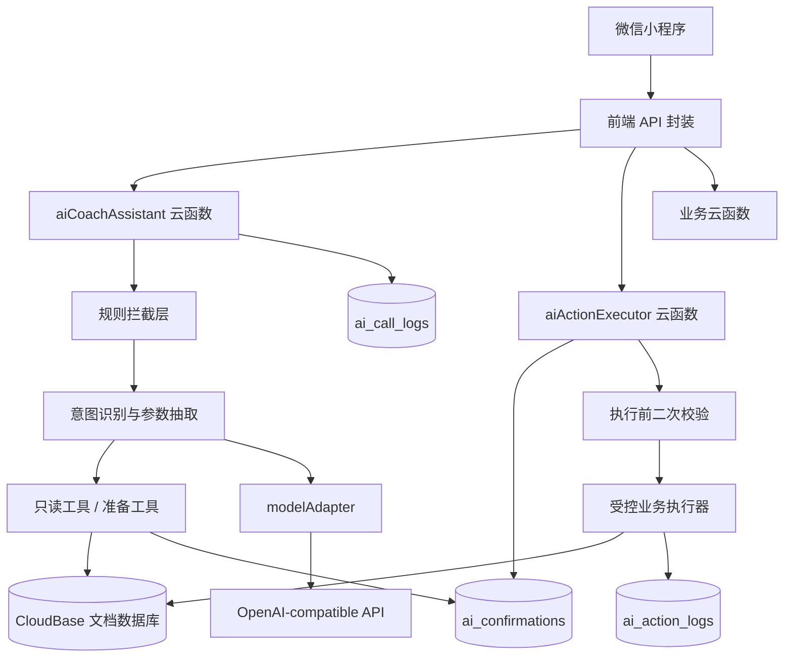

# AI 教练助手 v0.2 后端技术架构文档

> 日期：2026-06-25  
> 输入来源：`PRD_AI_COACH_ASSISTANT_V0.2.md`、`SYSTEM_DESIGN_AI_COACH_ASSISTANT_V0.1.md`、`FRONTEND_ARCHITECTURE_AI_COACH_ASSISTANT_V0.2.md`  
> 目标平台：微信小程序 + CloudBase 云开发  
> 文档范围：后端技术选型、云函数架构、AI 编排、语音转文字、数据库设计、权限安全、日志监控、实施顺序  
> 不包含：小程序页面实现、视觉设计、真实模型账号开通流程、部署操作手册

---

## 1. 结论摘要

### 1.1 第一版推荐技术方案

第一版后端采用：

```text
微信小程序
-> CloudBase 云函数
-> CloudBase 文档数据库
-> 后端 AI 网关 modelAdapter
-> 外部 OpenAI-compatible 模型 API
```

语音转文字第一版采用：

```text
微信同声传译插件
-> 转写文本进入输入框
-> 用户确认 / 修改后发送给 AI 后端
```

后端核心架构采用：

```text
AI 编排云函数
-> 规则拦截
-> 意图识别
-> 业务数据读取
-> 草稿 / 确认卡生成
-> 确认卡执行云函数
-> 受控写入数据库
```

### 1.2 为什么这么选

| 选型 | 推荐方案 | 原因 |
| --- | --- | --- |
| 后端运行时 | CloudBase 云函数 Node.js | 与微信小程序、OPENID、文档数据库天然集成，部署和权限成本低 |
| 数据库 | CloudBase 文档数据库 | 当前是单教练工具型业务，文档模型足够表达课程、学员、训练总结和 AI 卡片 |
| AI 接入 | 云函数 AI 网关 + `modelAdapter` | 不在小程序端暴露模型密钥；便于做权限校验、日志、限流和模型切换 |
| 第一版模型 | OpenAI-compatible API | 配置简单、可替换；后续可切换 CloudBase AI 托管模型 |
| 语音转文字 | 微信同声传译插件 | 第一版接入快，符合“转写文本先进入输入框”的产品要求 |
| AI 写入 | 确认卡 + 后端执行器 | 防止 AI 绕过人工确认，防止前端篡改写入 payload |

### 1.3 关键后端原则

- 小程序端不保存模型 API Key。
- AI 不直接写数据库。
- AI 只能生成回答、追问、草稿卡和确认卡。
- 所有写入动作必须服务端落库为确认卡。
- 前端确认时默认只提交 `confirmationId`，不提交完整业务 payload。
- 确认执行前后端必须重新校验 OPENID、教练身份、资源归属、课程状态、时间冲突和课时余额。
- 课时资产、删除数据、自动通知、自动完课扣课时不开放给 AI。

---

## 2. 后端总体架构

### 2.1 架构图



### 2.2 分层职责

| 层级 | 职责 | 不允许做什么 |
| --- | --- | --- |
| 小程序端 | 展示消息、录音、提交文本、展示确认卡、提交确认动作 | 持有模型密钥、直接执行 AI 写入 |
| AI 编排层 | 规则拦截、意图识别、读业务数据、生成草稿和确认卡 | 直接写核心业务集合 |
| 受控执行层 | 根据确认卡执行白名单动作，二次校验并写库 | 接受模型临时生成的任意动作 |
| 数据层 | 保存业务数据、AI 确认卡、日志、动作库 | 依赖前端传入 `_openid` 判断归属 |
| 模型适配层 | 统一调用外部模型，记录 usage、错误和超时 | 把业务权限判断交给模型 |

---

## 3. 技术选型

### 3.1 后端运行时：CloudBase 云函数

推荐使用 CloudBase 云函数 Node.js。

理由：

- 微信小程序调用云函数链路最短，不需要额外自建服务。
- 云函数内可通过 `cloud.getWXContext().OPENID` 获取当前用户身份。
- 与 CloudBase 文档数据库同环境，读取和写入成本低。
- 适合第一版“个人教练工具”规模，减少运维负担。
- 后续如果 AI 编排变复杂，可以把 AI 网关迁移到 CloudBase 云托管或独立服务。

### 3.2 数据库：CloudBase 文档数据库

第一版推荐文档数据库，不使用 MySQL。

理由：

- 业务对象以学员、课程、课程训练总结、确认卡为中心，天然适合文档模型。
- 小程序端普通查询和云函数受控写入都能使用同一套数据。
- 通过 `coach_openid` 做租户隔离，符合单教练 / 多教练账号扩展。
- 动作列表、训练总结、确认卡 payload 这类嵌套结构用文档存储更直接。

不选 MySQL 的原因：

- 第一版没有复杂报表、跨教练统计、强事务流水分析需求。
- MySQL 会增加部署、权限、数据访问层复杂度。
- 小程序 + CloudBase 文档库已能满足 v0.2 PRD 的主要验收。

### 3.3 AI 模型接入：云函数 AI 网关

第一版采用后端 `modelAdapter` 调外部 OpenAI-compatible API。

环境变量建议：

```text
LLM_PROVIDER=openai_compatible
LLM_BASE_URL=https://api.example.com/v1
LLM_API_KEY=******
LLM_MODEL=deepseek-chat
LLM_TIMEOUT_MS=20000
LLM_TEMPERATURE=0.2
```

回答用户的关键问题：可以在 CloudBase 后台配置 API，但应配置在云函数环境变量里。小程序端只调用云函数，不直接配置或暴露 API Key。

为什么不第一版就用小程序端 `wx.cloud.extend.AI`：

- 小程序端直连模型要求基础库、资源包、模型组都先确认。
- AI 写入安全仍然需要后端确认卡和二次校验。
- 小程序端直连会让意图识别、工具编排、权限校验分散。
- 第一版更需要稳定验证业务闭环，而不是绑定某个模型运行时。

后续切换 CloudBase AI 时，只替换 `modelAdapter`：

```text
aiCoachAssistant
-> modelAdapter.generateJson()
-> provider implementation
   - openaiCompatibleProvider
   - cloudbaseAiProvider
```

---

## 4. 云函数设计

### 4.1 云函数清单

第一版新增：

```text
cloudfunctions/
├── aiCoachAssistant/        # AI 编排入口
├── aiActionExecutor/        # 确认卡执行入口
├── aiTodayContext/          # 今日状态读取，可先并入 aiCoachAssistant
└── aiVoiceTranscribe/       # 后端语音识别预留，第一版可不启用
```

业务云函数建议保留或新增：

```text
cloudfunctions/
├── completeLesson/          # 手动完课确认后扣课时
├── adjustLessonBalance/     # 手动课时调整
├── saveStudent/             # 学员新增 / 编辑
├── saveLesson/              # 手动排课 / 修改课程
└── saveActionLibraryItem/   # 自定义动作和别名管理
```

### 4.2 `aiCoachAssistant`

定位：AI 编排入口，只负责理解、读取、生成草稿或确认卡，不直接执行写入。

入参：

```js
{
  text: "给小王明天下午三点排一节课",
  inputType: "text | voice",
  sourceContext: {
    source: "ai_home | lesson_detail | student_detail | schedule",
    student_id: "",
    lesson_id: ""
  },
  clientTime: "2026-06-25T10:00:00+10:00"
}
```

处理流程：

```text
1. 获取 OPENID。
2. 校验当前用户存在且是教练。
3. 清洗输入文本，合并 sourceContext。
4. 规则层先拦截 forbidden / out_of_scope / health_risk。
5. 调用模型做意图识别和参数抽取，要求返回结构化 JSON。
6. 根据意图调用只读工具读取业务上下文。
7. 信息不足时返回 followup。
8. 查询类返回 answer 或 data_card。
9. 写入类生成 confirmation，并保存到 ai_confirmations。
10. 记录 ai_call_logs。
11. 返回结构化响应给前端。
```

返回：

```js
{
  success: true,
  messageId: "ai_msg_xxx",
  type: "answer | followup | draft_card | confirm_card | result_card | refusal | error",
  text: "我找到了小王明天的课程...",
  card: {
    cardType: "schedule_confirm_card",
    confirmationId: "confirm_xxx"
  },
  evidence: [
    { type: "student", id: "student_xxx", label: "小王，剩余 8 课时" }
  ],
  usage: {
    provider: "openai_compatible",
    model: "configured-model",
    prompt_tokens: 0,
    completion_tokens: 0
  }
}
```

### 4.3 `aiActionExecutor`

定位：确认卡执行入口。前端点击确认后调用它。

入参：

```js
{
  confirmationId: "confirm_xxx",
  userEdits: {
    // 可选。仅允许确认卡声明过的可编辑字段。
  }
}
```

执行规则：

- 必须通过 `confirmationId` 读取服务端保存的原始确认卡。
- 不接受前端提交完整业务 payload 来直接执行。
- `userEdits` 只能覆盖确认卡允许编辑的字段。
- 执行前必须重新查询数据库并二次校验。

处理流程：

```text
1. 获取 OPENID。
2. 读取 ai_confirmations。
3. 校验 confirmation 属于当前教练。
4. 校验状态为 pending。
5. 校验未超过 15 分钟有效期。
6. 合并受允许的 userEdits。
7. 按 action_type 分发到受控执行器。
8. 执行前重新校验学员、课程、冲突、课时和所有权。
9. 执行业务写入。
10. 更新 ai_confirmations 状态。
11. 写 ai_action_logs。
12. 返回 result_card。
```

### 4.4 `aiVoiceTranscribe`

第一版不作为默认链路，只预留接口。

后续后端语音识别入参：

```js
{
  fileId: "cloud://xxx/audio/tmp_xxx.m4a",
  durationMs: 8000,
  source: "ai_home"
}
```

返回：

```js
{
  success: true,
  text: "给小王明天下午三点排一节课",
  confidence: 0.91
}
```

第一版语音优先走微信同声传译插件，后端接口仅保留扩展点。

---

## 5. AI 功能实现方案

### 5.1 第一版 AI 能力范围

只开放 v0.2 PRD 确认的核心能力：

| 能力 | 意图 | 输出 |
| --- | --- | --- |
| 查今日课表 | `query_today_lessons` | 普通回答 / 数据卡 |
| 查学员 | `query_student` | 学员数据卡 / 普通回答 |
| 语音排课 | `create_lesson` | 排课确认卡 |
| 课前训练方案 | `generate_training_plan` | 训练方案确认卡 |
| 记录训练 | `save_lesson_summary` | 课程训练总结确认卡 |

### 5.2 AI 意图识别怎么做

第一版采用“规则层 + 模型分类 + 白名单分发”。

```text
用户输入
-> 规则层先判断 forbidden / out_of_scope / health_risk
-> 模型只做意图识别和参数抽取
-> 后端校验 intent 是否在白名单
-> 后端按 intent 调用固定工具
-> 工具结果生成回答 / 追问 / 确认卡
```

意图枚举：

```js
const AI_INTENTS = {
  QUERY_TODAY_LESSONS: "query_today_lessons",
  QUERY_STUDENT: "query_student",
  CREATE_LESSON: "create_lesson",
  GENERATE_TRAINING_PLAN: "generate_training_plan",
  SAVE_LESSON_SUMMARY: "save_lesson_summary",
  OUT_OF_SCOPE: "out_of_scope",
  FORBIDDEN: "forbidden",
  AMBIGUOUS: "ambiguous"
};
```

模型结构化输出：

```js
{
  intent: "create_lesson",
  confidence: 0.86,
  slots: {
    student_name: "小王",
    date_text: "明天",
    start_time_text: "下午三点",
    duration_minutes: null,
    location: null,
    lesson_units: 1
  },
  missing_fields: ["location"],
  risk_flags: [],
  requires_confirmation: true
}
```

### 5.3 必须加的限制

AI 不能自由决定能做什么，必须加限制。

后端规则层优先拦截：

```text
forbidden:
- 修改课时余额
- 自动扣课时
- 自动完课并扣课时
- 删除学员
- 删除课程
- 清空训练记录
- 自动发微信通知
- 修改系统配置 / AI 配置 / 数据库权限
- 导出全量数据
```

无关问题处理：

```text
out_of_scope:
- 通用闲聊
- 非私教业务问题
- 医疗诊断
- 与当前小程序数据无关的复杂健身百科问答
```

允许的健身建议边界：

- 可以基于课程、学员备注、训练目标、伤病禁忌生成单节课方案草稿。
- 不能输出医疗诊断。
- 遇到疼痛、受伤、疾病风险时，应提示线下专业评估，不生成强执行方案。

### 5.4 工具协议

AI 不能直接拼数据库查询。后端提供固定工具。

只读工具：

| 工具 | 用途 |
| --- | --- |
| `get_today_lessons` | 查询今日课程 |
| `get_lessons_by_range` | 查询时间范围课程 |
| `get_student_candidates` | 按名称搜索学员 |
| `get_student_detail` | 读取学员基础信息 |
| `get_lesson_detail` | 读取课程详情 |
| `get_recent_lesson_summaries` | 读取近期课程总结 |
| `get_action_library` | 读取系统和自定义动作库 |

准备工具：

| 工具 | 用途 |
| --- | --- |
| `prepare_create_lesson` | 生成排课确认卡 |
| `prepare_training_plan` | 生成训练方案确认卡 |
| `prepare_lesson_summary` | 生成课程训练总结确认卡 |

执行工具：

| 工具 | 调用方 |
| --- | --- |
| `executeCreateLesson` | `aiActionExecutor` |
| `executeSaveTrainingPlan` | `aiActionExecutor` |
| `executeSaveLessonSummary` | `aiActionExecutor` |

### 5.5 课程训练总结生成

处理步骤：

```text
1. 识别学员和课程。
2. 找不到课程时追问，不生成确认卡。
3. 读取课程已有课前训练方案。
4. 读取动作库和别名。
5. 模型抽取训练主题、动作、重量、组数、次数、强度、完成度、问题、总结。
6. 后端做动作归一和冲突检测。
7. 对比课前方案和课后实际。
8. 歧义动作或关键冲突先追问。
9. 生成课程训练总结确认卡。
10. 教练确认后保存。
```

动作归一优先级：

```text
1. 当前课程课前训练方案
2. 用户自定义动作库和别名
3. 系统默认动作库和别名
4. AI 根据上下文推断
5. 确认卡中要求教练选择
6. 保留原始名称并标记 unnormalized
```

---

## 6. 语音转文字方案

### 6.1 第一版方案：微信同声传译插件

推荐链路：

```text
长按录音
-> 微信同声传译插件转文字
-> 转写文本填入输入框
-> 用户可编辑
-> 点击发送
-> aiCoachAssistant 处理
```

为什么这样选：

- v0.2 PRD 明确要求“转写文本先进入输入框，用户可修改后再发送”。
- 第一版不需要把语音直接变成业务写入。
- 插件方案接入快，减少音频存储、转码和识别服务接入成本。
- 转写失败可自然降级为文本输入。

第一版语音规则：

- 不长期保存原音频。
- 转写失败后保留输入框现有文本。
- 转写文本不自动发送。
- AI 后续失败时保留转写文本，用户可重试或手动编辑。

### 6.2 预留后端语音识别

如果后续需要更高准确率或更稳定的识别，可切换为：

```text
RecorderManager 录音
-> 上传临时音频到 CloudBase Storage
-> aiVoiceTranscribe 云函数调用语音识别服务
-> 返回文本
-> 删除临时音频
```

后端识别方案适合后续场景：

- 需要自定义热词，例如动作名、学员昵称。
- 需要统一识别日志和质量分析。
- 需要规避插件限制。
- 需要服务端重试和多供应商兜底。

---

## 7. 数据库设计

### 7.1 集合总览

业务集合：

```text
users
students
lessons
lesson_summaries
lesson_balance_logs
coach_settings
action_library
action_aliases
```

AI 集合：

```text
ai_messages
ai_confirmations
ai_call_logs
ai_action_logs
```

第一版不做长期多会话管理，因此不强制新增 `ai_conversations`。AI 首页当前会话可由前端内存态承载，关键卡片和日志由服务端保存。

### 7.2 通用字段规则

所有业务集合必须包含：

```js
{
  coach_openid: "openid",
  created_at: Date,
  updated_at: Date,
  deleted_at: null
}
```

规则：

- `coach_openid` 是租户隔离字段。
- 云函数写入时由 `cloud.getWXContext().OPENID` 注入，不接受前端提交。
- 第一版尽量使用软删除，但 v0.2 不开放 AI 删除能力。
- 所有查询默认加 `coach_openid` 条件。

### 7.3 `users`

用途：教练账户。

```js
{
  _id: "user_xxx",
  openid: "openid",
  role: "coach",
  name: "教练名",
  avatar_url: "",
  phone: "",
  status: "active",
  created_at: Date,
  updated_at: Date
}
```

索引建议：

```text
openid unique
role
```

### 7.4 `students`

用途：学员档案、课时余额、AI 参考备注。

```js
{
  _id: "student_xxx",
  coach_openid: "openid",
  name: "小王",
  nickname: "王同学",
  phone: "",
  remaining_lessons: 8,
  default_location: "工作室",
  training_goal: "减脂塑形",
  injury_notes: "膝盖不适，避免高冲击跳跃",
  ai_notes: "上肢力量弱，动作学习快",
  status: "active",
  created_at: Date,
  updated_at: Date,
  deleted_at: null
}
```

索引建议：

```text
coach_openid + status
coach_openid + name
coach_openid + updated_at
```

设计说明：

- `remaining_lessons` 是敏感资产，AI 不允许直接修改。
- 课时变化必须通过受控函数写入 `lesson_balance_logs`。
- 同名学员允许存在，AI 必须追问选择。

### 7.5 `lessons`

用途：课程排期和课前训练方案。

```js
{
  _id: "lesson_xxx",
  coach_openid: "openid",
  student_id: "student_xxx",
  student_name_snapshot: "小王",
  date: "2026-06-25",
  start_at: Date,
  end_at: Date,
  location: "工作室",
  status: "confirmed | completed | cancelled",
  lesson_units: 1,
  training_plan: {
    theme: "胸和三头",
    warmup: ["肩胛激活", "弹力带外旋"],
    planned_actions: [
      {
        raw_name: "卧推",
        canonical_name: "杠铃卧推",
        planned_weight: "",
        planned_sets: 4,
        planned_reps: "8-10次",
        notes: ""
      }
    ],
    notes: "",
    source: "ai | manual",
    updated_at: Date
  },
  summary_status: "none | completed",
  created_source: "ai | manual",
  created_at: Date,
  updated_at: Date,
  cancelled_at: null
}
```

索引建议：

```text
coach_openid + start_at
coach_openid + student_id + start_at
coach_openid + status + start_at
```

状态规则：

- 新建课程状态为 `confirmed`。
- 取消课程不扣课时，状态为 `cancelled`。
- 完课扣课时由传统完课确认流程执行，不由 AI 自动执行。
- `lesson_units` 取值只允许 `0.5`、`1`、`1.5`、`2`。

### 7.6 `lesson_summaries`

用途：绑定单节课的课程训练总结。

```js
{
  _id: "summary_xxx",
  coach_openid: "openid",
  student_id: "student_xxx",
  lesson_id: "lesson_xxx",
  theme: "上肢训练",
  warmup: ["动态拉伸"],
  planned_actions: [],
  actual_actions: [
    {
      raw_name: "面拉",
      canonical_name: "坐姿面拉",
      normalization_status: "matched_alias",
      actual_weight: "20kg",
      actual_sets: 3,
      actual_reps: 15,
      status: "completed",
      replaced_by: "",
      reason: "",
      notes: "动作控制好"
    }
  ],
  highlights: ["坐姿面拉完成度高"],
  intensity: "中强度",
  completion_rate: 90,
  issues: ["最后一组肩部代偿"],
  final_summary: "整体状态不错，下次可逐步增加背部容量。",
  plan_diff: [
    {
      type: "modified | skipped | replaced | added | unknown",
      action_name: "杠铃卧推",
      description: "计划卧推，实际未提到，标记 unknown"
    }
  ],
  display_text: "6.25 小王课程总结...",
  source: "ai | manual",
  created_at: Date,
  updated_at: Date
}
```

索引建议：

```text
coach_openid + lesson_id unique
coach_openid + student_id + created_at
coach_openid + updated_at
```

设计说明：

- 第一版课程总结必须绑定单节课程。
- 保存后不允许重新绑定到其他课程。
- 同一课程只能有一份总结；再次保存为覆盖更新。
- 必须同时保存 `raw_name` 和 `canonical_name`。

### 7.7 `lesson_balance_logs`

用途：课时变动记录，不可删除。

```js
{
  _id: "balance_log_xxx",
  coach_openid: "openid",
  student_id: "student_xxx",
  type: "recharge | manual_deduct | complete_lesson",
  delta: -1,
  before_balance: 8,
  after_balance: 7,
  lesson_id: "lesson_xxx",
  note: "完课扣减",
  operator: "coach",
  created_at: Date
}
```

索引建议：

```text
coach_openid + student_id + created_at
coach_openid + lesson_id
```

AI 限制：

- AI 不能创建 `lesson_balance_logs`。
- AI 不能修改 `students.remaining_lessons`。
- 完课扣减只能由手动完课确认流程触发。

### 7.8 `coach_settings`

用途：教练默认设置。

```js
{
  _id: "settings_xxx",
  coach_openid: "openid",
  default_lesson_duration_minutes: 60,
  timezone: "Australia/Sydney",
  created_at: Date,
  updated_at: Date
}
```

第一版不在此集合保存 AI 模型配置。模型配置属于云函数环境变量或后台配置，不暴露给小程序。

### 7.9 `action_library`

用途：系统默认动作和教练自定义动作。

```js
{
  _id: "action_xxx",
  coach_openid: "openid | system",
  canonical_name: "杠铃卧推",
  body_part: "胸",
  equipment: "杠铃",
  movement_type: "推",
  source: "system | custom",
  status: "active | inactive",
  notes: "",
  created_at: Date,
  updated_at: Date
}
```

索引建议：

```text
source + status
coach_openid + status
canonical_name
body_part
```

### 7.10 `action_aliases`

用途：动作别名映射。

```js
{
  _id: "alias_xxx",
  coach_openid: "openid | system",
  alias: "卧推",
  action_id: "action_xxx",
  canonical_name: "杠铃卧推",
  source: "system | custom",
  status: "active | inactive",
  created_at: Date,
  updated_at: Date
}
```

索引建议：

```text
coach_openid + alias + status
source + alias + status
action_id
```

别名规则：

- 用户自定义别名优先于系统别名。
- 一个别名命中多个动作时，不自动归一，必须让教练选择。
- AI 修正后的长期别名保存需要单独确认，第一版可先不自动沉淀。

### 7.11 `ai_messages`

用途：保存必要 AI 消息记录。第一版可只保留最近消息，避免无限增长。

```js
{
  _id: "ai_msg_xxx",
  coach_openid: "openid",
  role: "user | assistant",
  type: "text | answer | followup | confirm_card | result_card | refusal | error",
  text: "今天有哪些课？",
  card_ref: "confirm_xxx",
  source_context: {
    source: "ai_home",
    student_id: "",
    lesson_id: ""
  },
  created_at: Date
}
```

索引建议：

```text
coach_openid + created_at
coach_openid + card_ref
```

### 7.12 `ai_confirmations`

用途：保存确认卡和待执行 payload。

```js
{
  _id: "confirm_xxx",
  coach_openid: "openid",
  status: "pending | confirmed | cancelled | expired | failed",
  action_type: "create_lesson | save_training_plan | save_lesson_summary",
  card_type: "schedule_confirm_card | training_plan_confirm_card | lesson_summary_confirm_card",
  title: "确认排课",
  summary: "给小王创建 2026-06-25 15:00 的课程",
  display_fields: [
    { label: "学员", value: "小王" },
    { label: "时间", value: "2026-06-25 15:00-16:00" }
  ],
  editable_fields: ["location", "lesson_units"],
  payload: {
    student_id: "student_xxx",
    lesson_id: "",
    start_at: Date,
    end_at: Date,
    location: "工作室",
    lesson_units: 1
  },
  evidence: [
    { type: "student", id: "student_xxx", label: "小王，剩余 8 课时" }
  ],
  expires_at: Date,
  executed_at: null,
  error_message: "",
  created_at: Date,
  updated_at: Date
}
```

索引建议：

```text
coach_openid + status + expires_at
coach_openid + created_at
```

设计规则：

- 有效期 15 分钟。
- 前端确认只传 `confirmationId`。
- 执行前必须读取服务端 payload 并二次校验。
- 过期确认卡不能执行。

### 7.13 `ai_call_logs`

用途：记录模型调用和 AI 编排质量。

```js
{
  _id: "ai_call_log_xxx",
  coach_openid: "openid",
  request_type: "intent | answer | generate_plan | parse_summary",
  intent: "create_lesson",
  provider: "openai_compatible",
  model: "configured-model",
  input_length: 42,
  success: true,
  error_code: "",
  error_message: "",
  latency_ms: 1200,
  usage: {
    prompt_tokens: 0,
    completion_tokens: 0,
    total_tokens: 0
  },
  created_at: Date
}
```

索引建议：

```text
coach_openid + created_at
success + created_at
intent + created_at
```

### 7.14 `ai_action_logs`

用途：记录确认卡执行结果。

```js
{
  _id: "ai_action_log_xxx",
  coach_openid: "openid",
  confirmation_id: "confirm_xxx",
  action_type: "create_lesson",
  target_type: "lesson",
  target_id: "lesson_xxx",
  success: true,
  error_code: "",
  error_message: "",
  created_at: Date
}
```

索引建议：

```text
coach_openid + created_at
confirmation_id
action_type + created_at
```

---

## 8. 确认卡协议

### 8.1 确认卡类型

| 卡片 | action_type | 是否 AI 可生成 | 是否可执行 |
| --- | --- | --- | --- |
| 排课确认卡 | `create_lesson` | 是 | 是 |
| 训练方案确认卡 | `save_training_plan` | 是 | 是 |
| 课程训练总结确认卡 | `save_lesson_summary` | 是 | 是 |
| 完课确认卡 | `complete_lesson` | 否 | 由传统日程流程生成 |
| 课时调整确认卡 | `adjust_balance` | 否 | 仅手动流程 |

### 8.2 排课确认卡校验

执行前必须校验：

- 学员存在且属于当前教练。
- 时间明确，不能是“下午”“晚点”等模糊表达。
- `end_at > start_at`。
- 时间段没有冲突课程。
- `lesson_units` 为 `0.5`、`1`、`1.5`、`2`。
- 学员剩余课时不少于 `lesson_units`。
- 地点存在；如果学员没有常用地点，必须由用户填写。

### 8.3 训练方案确认卡校验

执行前必须校验：

- 课程存在且属于当前教练。
- 课程状态不是 `cancelled`。
- 训练方案绑定到单节课程。
- 如果已有训练方案，提示覆盖更新。

### 8.4 课程训练总结确认卡校验

执行前必须校验：

- 课程存在且属于当前教练。
- 学员存在且属于当前教练。
- 总结绑定到单节课程。
- 动作归一结果合法。
- 存在歧义动作时必须用户选择后才能执行。
- 如果已有课程总结，执行覆盖更新。

---

## 9. 权限与安全

### 9.1 身份来源

云函数中统一使用：

```js
const wxContext = cloud.getWXContext();
const openid = wxContext.OPENID;
```

规则：

- 不接受前端传入 `coach_openid`。
- 不接受前端传入 `_openid`。
- 所有查询和写入都附加 `coach_openid = openid`。
- 当前用户必须在 `users` 中存在且 `role = coach`。

### 9.2 数据库权限策略

建议：

- 核心业务写入优先走云函数。
- 小程序端可读本人数据，但高风险集合不允许客户端直接写。
- `ai_confirmations`、`ai_call_logs`、`ai_action_logs` 不开放客户端直接写。
- `lesson_balance_logs` 不开放客户端删除。

### 9.3 AI 禁止操作

无论用户如何要求，AI 都不能执行：

```text
修改课时余额
自动扣课时
自动完课并扣课时
删除学员
删除课程
清空训练记录
自动发通知
修改 AI 配置
修改数据库权限
导出全量数据
```

这些请求应返回 `refusal`，并引导到手动页面或说明原因。

### 9.4 模型输出安全

模型输出必须满足：

- 返回 JSON，不返回自由执行代码。
- `intent` 必须在白名单内。
- `action_type` 必须在白名单内。
- 写入类必须 `requires_confirmation = true`。
- 数据回答必须带 evidence，不能编造数据库不存在的信息。
- 数据不足时必须说明不足或追问。

---

## 10. 错误处理与降级

### 10.1 AI 不可用

返回：

```js
{
  success: false,
  type: "error",
  error_code: "AI_UNAVAILABLE",
  text: "AI 暂时不可用，可以先使用文字记录或手动排课。"
}
```

降级规则：

- 传统日程、学员、手动排课、手动课时管理继续可用。
- 语音转写成功但 AI 失败时，保留输入框文本。
- 模型超时不重试写入，只允许用户再次发送。

### 10.2 语音失败

处理：

- 麦克风未授权：提示授权或改用文本输入。
- 转写失败：提示重试或手动输入。
- AI 后续失败：保留转写文本，不丢失输入。

### 10.3 确认卡失败

失败场景：

- 确认卡过期。
- 已被执行或取消。
- 学员课时不足。
- 排课时间发生新冲突。
- 课程已取消。
- 目标资源不属于当前教练。

返回结果卡说明失败原因，并允许用户重新发起。

---

## 11. 日志与指标

### 11.1 必须记录

AI 调用：

- intent
- success
- latency_ms
- provider / model
- token usage
- error_code / error_message

确认卡执行：

- confirmation_id
- action_type
- target_type
- target_id
- success
- error_message

### 11.2 第一版指标

产品指标：

- 语音转写成功率。
- AI 意图识别成功率。
- 追问后任务完成率。
- 排课确认卡确认率。
- 课程训练总结确认卡确认率。
- AI 失败后转文本或手动流程完成率。

技术指标：

- `aiCoachAssistant` 平均耗时。
- 模型调用超时率。
- 确认卡执行失败率。
- forbidden 拦截次数。
- out_of_scope 拒答次数。

---

## 12. 实施顺序

### Phase 1：后端基础设施

- 新增 `aiCoachAssistant` 云函数骨架。
- 新增 `modelAdapter`，支持 OpenAI-compatible API。
- 新增 `ai_call_logs`。
- 支持 `query_today_lessons` 和 `query_student` 两个只读意图。

验收：

- 能基于数据库回答今日课程。
- 能查询学员剩余课时和最近课程。
- AI 回答带 evidence，不编造数据。

### Phase 2：确认卡基础设施

- 新增 `ai_confirmations`。
- 新增 `aiActionExecutor`。
- 实现确认卡状态、15 分钟过期、`confirmationId` 执行。
- 新增 `ai_action_logs`。

验收：

- 前端确认只传 `confirmationId`。
- 过期确认卡不能执行。
- 非本人确认卡不能执行。

### Phase 3：AI 排课

- 实现 `create_lesson` 意图。
- 实现学员匹配、同名追问、时间解析、课时校验、冲突校验。
- 实现 `executeCreateLesson`。

验收：

- 语音或文本能生成排课确认卡。
- 课时不足不能确认。
- 时间冲突不能确认。
- 确认后课程出现在日程。

### Phase 4：训练方案

- 实现 `generate_training_plan` 意图。
- 读取学员目标、伤病禁忌、课程上下文。
- 保存到 `lessons.training_plan`。

验收：

- 训练方案必须绑定单节课程。
- 找不到课程先追问。
- 已有方案时提示覆盖更新。

### Phase 5：课程训练总结和动作归一

- 新增 `lesson_summaries`。
- 初始化系统默认动作库。
- 实现动作别名匹配和歧义处理。
- 实现 `save_lesson_summary`。

验收：

- 每个动作保存 `raw_name` 和 `canonical_name`。
- 歧义动作不能强行合并。
- 课前方案和课后实际差异展示在确认卡。
- 同一课程总结重复保存为更新。

### Phase 6：语音接入

- 小程序接入微信同声传译插件。
- 转写文本进入输入框，不自动发送。
- 后端保留 `aiVoiceTranscribe` 扩展点。

验收：

- 长按录音支持取消。
- 转写失败可改用文本。
- AI 失败不丢失转写文本。

---

## 13. 验收清单

- 打开小程序默认进入 AI 助手。
- 教练能用语音完成一次课程训练总结生成。
- 教练能用语音完成一次排课。
- 教练能查询今日课表。
- 教练能查询学员剩余课时和最近课程总结。
- 语音转写结果先进入输入框，用户可修改后再发送。
- 每个 AI 写入动作都有服务端确认卡。
- 前端确认只提交 `confirmationId`。
- 同名学员、学员不存在、课程不存在、时间模糊必须追问。
- 时间冲突、课时不足不能写入。
- AI 不允许修改课时余额。
- AI 不允许自动扣课时或自动完课。
- 课程训练总结保存 `raw_name` 和 `canonical_name`。
- 动作归一不确定时追问或在确认卡中要求选择。
- AI 不可用时传统手动流程仍可使用。

---

## 14. 已确认决策

1. 第一版后端采用 CloudBase 云函数。
2. 第一版数据库采用 CloudBase 文档数据库。
3. AI 接入采用云函数 AI 网关，模型 API 配置在后端环境变量。
4. 第一版模型调用使用 OpenAI-compatible API，后续通过 `modelAdapter` 切换 CloudBase AI。
5. 语音转文字第一版采用微信同声传译插件，后端预留 `aiVoiceTranscribe`。
6. AI 意图识别采用规则层 + 模型分类 + 白名单分发。
7. AI 写入只生成确认卡，不直接写数据库。
8. 确认卡有效期 15 分钟。
9. 前端确认默认只传 `confirmationId`。
10. 课时资产、删除数据、自动通知、自动完课扣课时不开放给 AI。

